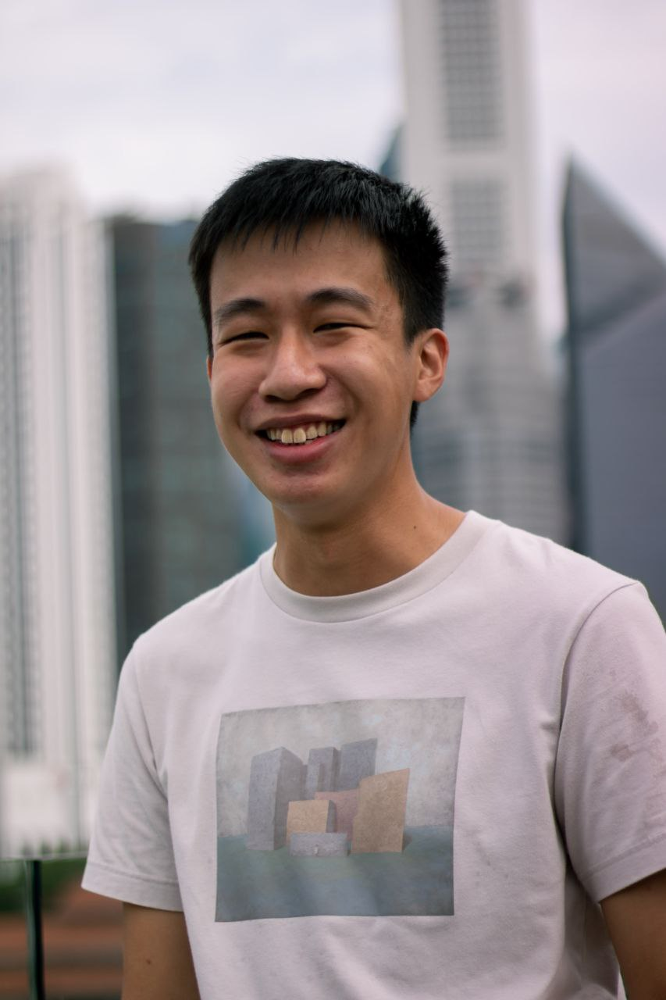
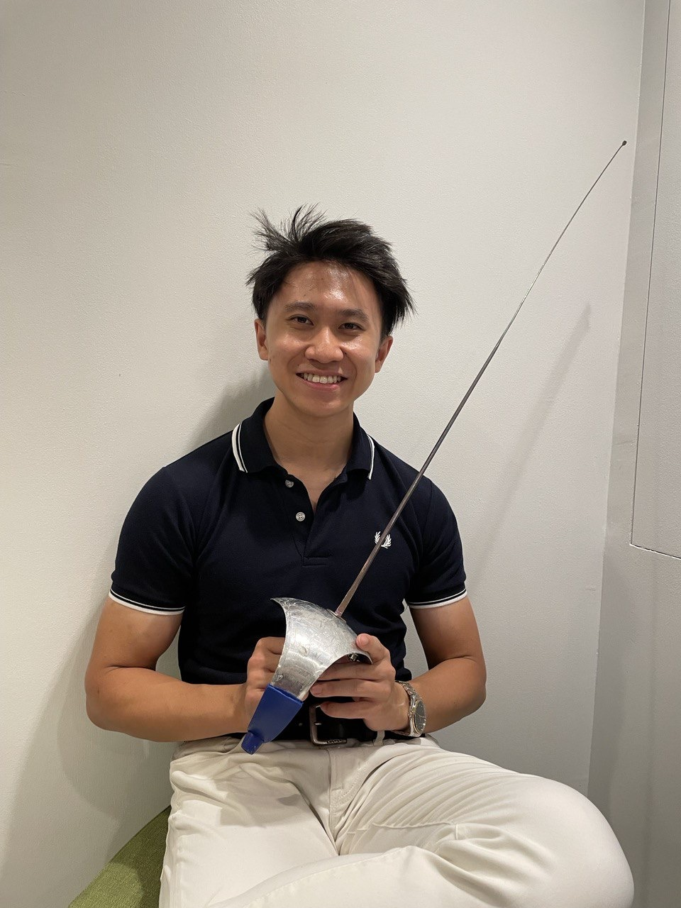
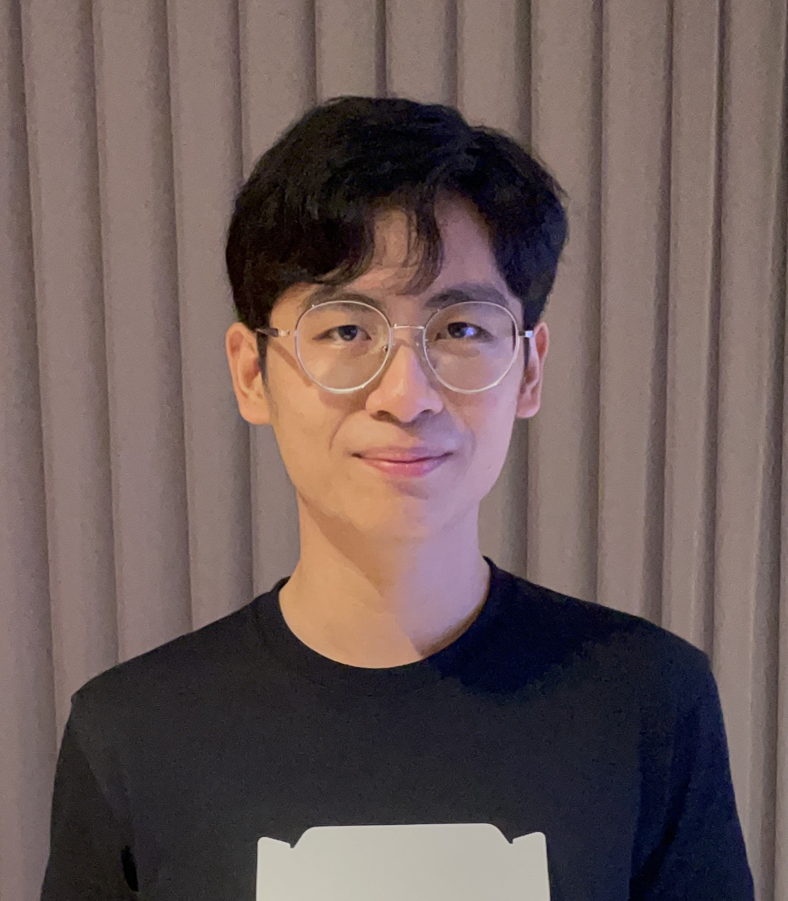
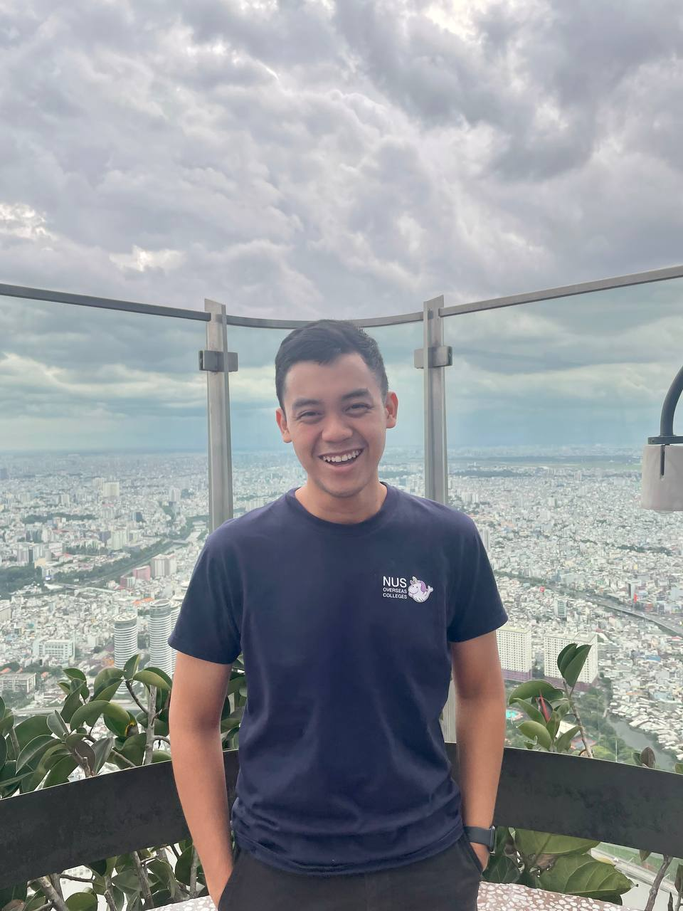
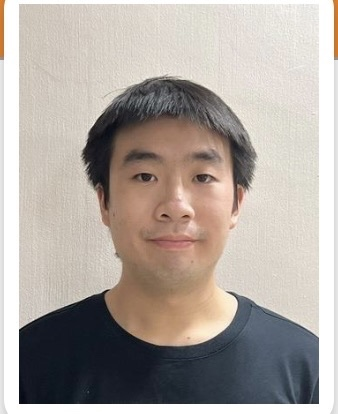

# About Us

We are a team based in the [School of Computing, National University of Singapore](http://www.comp.nus.edu.sg).

You can reach us at the email `seer[at]comp.nus.edu.sg`

## Project team

### Benjamin Koh Zhao Hui

[[github](https://github.com/b-enguin)]
[[portfolio](team/b-enguin.md)]

* Role: Developer

### Lim Jian Yang

[[github](http://github.com/jianyangg)]
[[portfolio](team/jianyangg.md)]

* Role: Deliverables and deadlines
* Responsibilities: Ensure project deliverables are done on time and in the right format.

### Lim Zhong Han

[[github](http://github.com/zhonghan721)] [[portfolio](team/zhonghan721.md)]

* Role: Member

### Julius Gambe

[[github](http://github.com/juliusgambe)]
[[portfolio](team/juliusgambe.md)]

* Role: Developer

### Gabriel Seethor Jun Hao

[[github](http://github.com/gabriel4357)]
[[portfolio](team/gabriel4357.md)]

* Role: Scheduling and Tracking
* Responsibilities:  In charge of defining, assigning, and tracking project tasks.
