# User Guide 

# About HomeBoss

HomeBoss is a desktop application for **home-based business owners** to **manage their customers and deliveries**. 
HomeBoss streamlines the process of your operations, optimises your resources, and enhances your overall business 
experience. 

With our application, you will be able to: 
* Keep track of the details of your customers and deliveries
* Search for a particular customer/delivery easily
* Organise your data in a neat and tidy manner by filtering and sorting to your needs  
 
and much more!

All these are done to improve your efficiency and productivity all while being incredibly simple to use.
HomeBoss is also **optimised for fast typist with the use of a Command Line Interface (CLI)**, allowing you to 
execute commands quickly. On top of that, we utilise a *Graphical User Interface (GUI)* to let you view your 
data in a neater and more organised manner. 

Essentially, with HomeBoss, you can **focus on what matters most: running your business**.

---
## About this User Guide

This user guide provides you with everything that you need to know when using HomeBoss.

If you are new to HomeBoss, head over to the [Quick Start Guide](#quick-start-guide) section for a quick overview
on how to get started.

Additionally, this user guide provides you with detailed explanations of all the features available
in the [Features](#features) section.

For experienced users, you may refer to the [Command Summary](#command-summary) section for a quick summary of all the
commands available in HomeBoss.

If you would like to learn about the technical aspects of HomeBoss,
you may refer to the [Developer Guide](./DeveloperGuide.md).

### Navigating the User Guide

**Note Box**
<box background-color="#dff0d8" border-color="#d6e9c6" type="info" header="Note">
Provides you with information that is useful to know.
</box>

**Tip Box**
<box background-color="#d9edf7" border-color="#bce8f1" type="tip" header="Tip">
Provides you with information that can help enhance your user experience but is not necessary to know.
</box>

**Warning Box**
<box background-color="#f2dede" border-color="#ebccd1" type="warning" header="Warning">
Important information for you to take note of to avoid any unintended effects!
</box>

**Links**

* Words in blue are [links](#navigating-the-user-guide) that you can click on to navigate to the relevant section.

* A [&uarr; Back to Table of Contents](#table-of-contents) link is available at the end of every section
for you to return to the Table of Contents, so that you can access another section from there easily.

---
# Table of Contents

* 1\. Introduction
  * 1.1 About HomeBoss
  * 1.2 About this User Guide
  * 1.3 Navigating the User Guide
* 2\. Table of Contents
* 3\. [Getting Started](#getting-started)
  * 3.1 [Prerequisites](#prerequisites)
* 4\. Features
  * 4.1 User
    * 4.1.1 [Register](#register)
    * 4.1.2 [Login](#login)
    * 4.1.3 [Update details](#update-details)
    * 4.1.4 [Logout](#logout)
    * 4.1.5 [Account recovery](#account-recovery)
    * 4.1.6 [Account deletion](#account-deletion)
  * 4.2 Customer
    * 4.2.1 [Add customer](#add-a-customer)
    * 4.2.2 [Find customers](#find-customers)
    * 4.2.3 List customers
    * 4.2.4 Update customer details
    * 4.2.5 [Delete customer](#delete-customer)
  * 4.3 Delivery
    * 4.3.1 Add delivery
    * 4.3.2 View all deliveries
    * 4.3.3 View details of deliveries
    * 4.3.4 Update details of delivery
    * 4.3.5 Update delivery status
    * 4.3.6 Create a note for a delivery
    * 4.3.7 Delete delivery
    * 4.3.8 [Find deliveries](#find-deliveries)
  * 4.4 Miscellaneous
    * 4.4.1 [Help](#help)
    * 4.4.2 [Exit](#exit)
    * 4.4.3 [Clear](#clear)
* 5\. FAQ
* 6\. Command Summary
* 7\. Glossary

---
# Getting Started

To get started, you will need to create an account and download the software. Once you have done that, you can follow
the instructions in the Getting Started Guide to start using the software.

---

# Command Summary

Here is a brief introduction to the commands that you will be using in HomeBoss. For more detailed information, please
refer to the [Features](#features) section.

### User

_These are commands for managing your user account in HomeBoss._

- `register` - Registers a new user account to use HomeBoss.
- `login` - Logs in to your user account.
- `update` - Updates your user account details.
- `logout` - Logs out of your user account.
- `recover account` - Recovers your user account.
- `delete account` - Deletes your user account.

### Customer

_These are commands for managing your customers in HomeBoss._

- `customer add` - Adds a customer to the address book.
- `customer find` - Finds customers whose names contain any of the given keywords.
- `customer list` - Lists all customers in the address book.
- `customer edit` - Updates the details of an existing customer in the address book.
- `customer delete` - Deletes the specified customer from the address book.

### Delivery

_These are commands for managing your deliveries in HomeBoss._

- `delivery add` - Adds a delivery to the delivery book.
- `delivery list` - Lists all deliveries in the delivery book.
- `delivery view` - Shows the details of the specified delivery.
- `delivery status` - Changes the status of a specified delivery.
- `delivery note` - Creates a note for a specified delivery.
- `delivery delete` - Deletes the specified delivery from the delivery book.

### Miscellaneous

_These are general commands for using HomeBoss._

- `help` - Shows a list of commands and their usage.
- `exit` - Exits the program.
- `clear` - Clears both customer and delivery database. **Warning:** This action is irreversible.

---

# Features

\*[ ] specifies optional fields

## User

### Register

> Registers a new user account to use HomeBoss.

_Want to get started? Start by registering for an account to use HomeBoss! Note that only one account can be registered
at a time._

**Format:
** `register --user USERNAME --password PASSWORD --confirmPass CONFIRM_PASSWORD --secretQn SECRET_QUESTION --answer ANSWER`

**Example:
** `register --user gabriel --password gabrielIsGreat --confirmPass gabrielIsGreat --secretQn First pet's name? --answer Koko`

:information_source: **Note:** All fields are required.

**Before:**
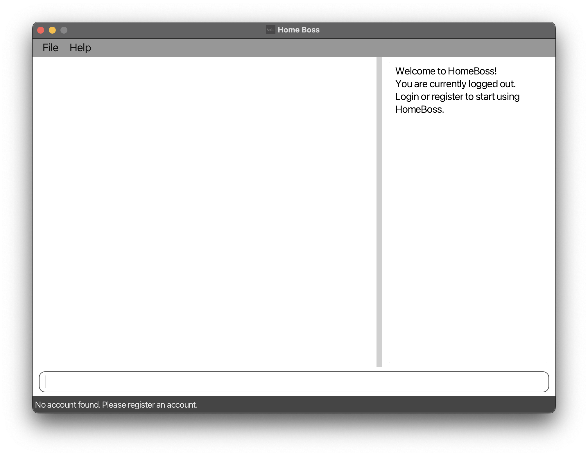
**After:**
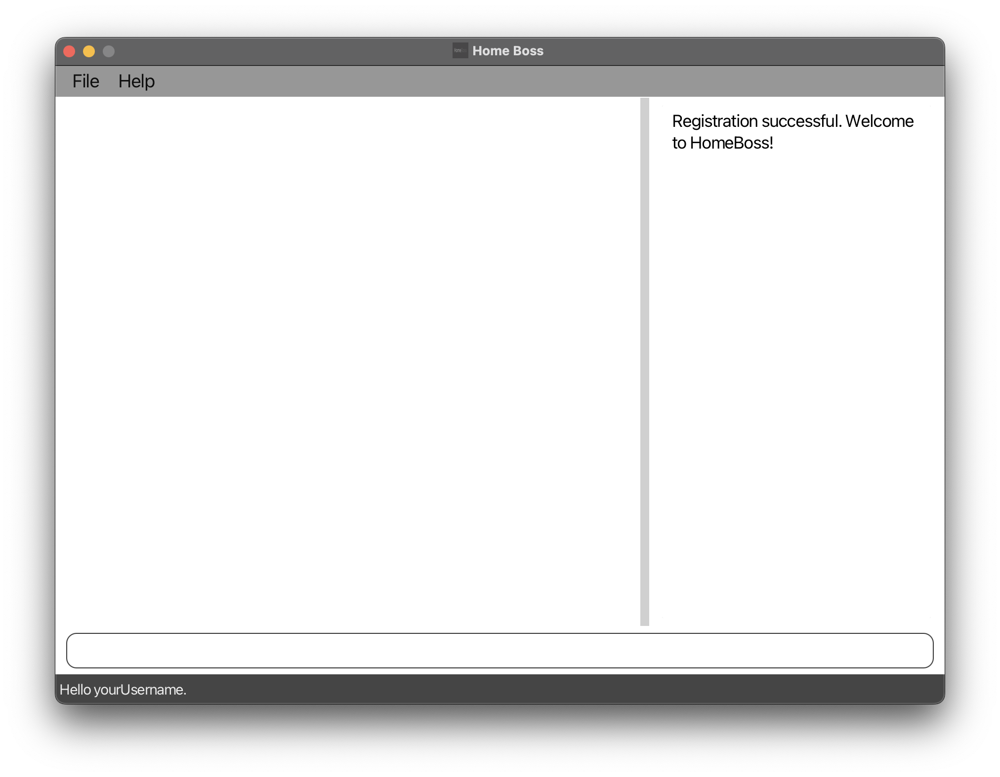
[&uarr; Back to Table of Contents](#table-of-contents)

### Login

> Logs in to your user account.

_Want to access your data in HomeBoss? You can log in to your account by calling this command.
Note that you need to have an account registered with HomeBoss._

**Format:** `login --user USERNAME --password PASSWORD`

<box background-color="#dff0d8" border-color="#d6e9c6" type="info" header="Note">
    All fields are required.
</box>

**Example:**

* `login --user gabriel --password gabrielIsGreat`

**Before:**

**After:**
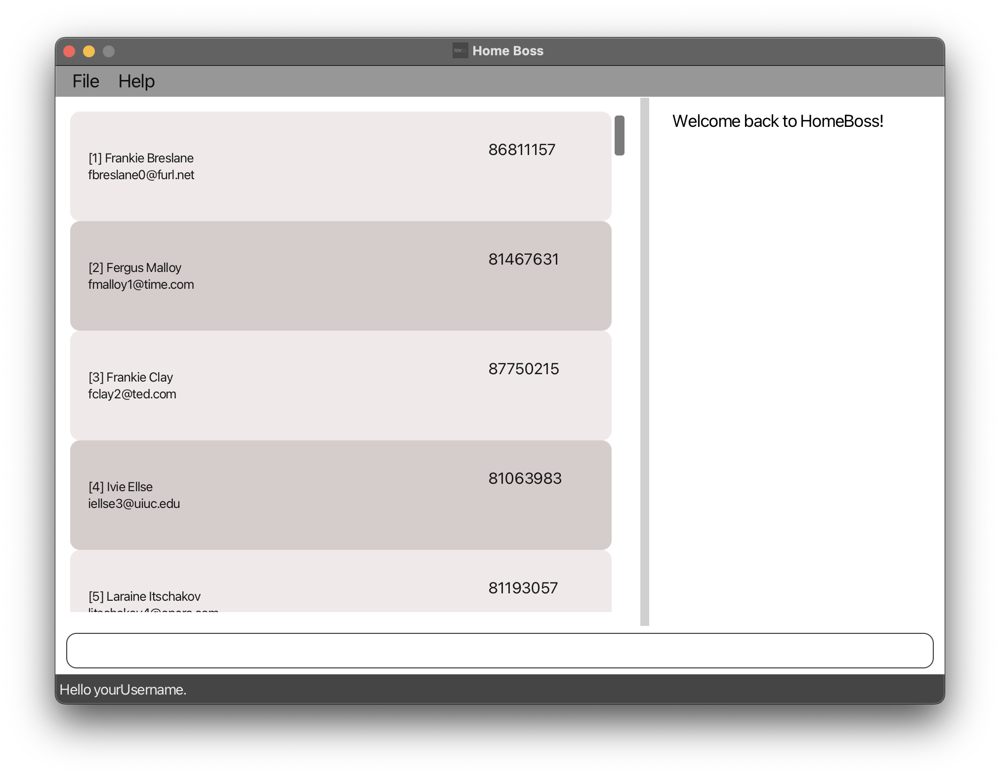
[&uarr; Back to Table of Contents](#table-of-contents)

### Update details

> Updates your user account details.

Want to keep your account secure? You can update your account details by calling this command.

**Format:** `update [--user USERNAME] [--password PASSWORD --confirmPass CONFIRM_PASSWORD]
[--secretQn SECRET_QUESTION --answer ANSWER]`

<box background-color="#dff0d8" border-color="#d6e9c6" type="info" header="Note">
    * [] around a group of parameters indicates that it is optional, but all parameters within the group must be provided.
    * At least one of the optional fields must be provided.
    * If PASSWORD is provided, CONFIRM_PASSWORD must also be provided, vice versa.
    * If SECRET_QUESTION is provided, ANSWER must also be provided, vice versa.
    * The details will be updated without checking against the current details.
</box>

**Example:**

* `update --user gabrielV2 --password gabrielIsBest --confirmPass gabrielIsBest
  --secretQn Favourite Pet --answer BoBo`

**Before:**

**After:**

[&uarr; Back to Table of Contents](#table-of-contents)

### Logout

> Logs out of your user account.

_Want to keep your data secure at the end of the day? You can log out of your account by calling this command._

**Format:** `logout`

**Before:**

**After:**
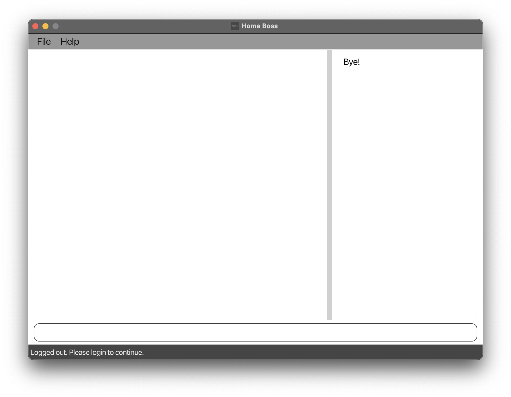
[&uarr; Back to Table of Contents](#table-of-contents)

### Account Recovery

> Recovers the user account.

_Forgot your password? Use this command to recover your account!_

**Format:** `recover account [--answer ANSWER --password NEW_PASSWORD --confirmPass CONFIRM_PASSWORD]`

**Examples:**

- `recover account` 
- `recover account --answer Koko --password newPassword123 --confirmPass newPassword123` 

:information_source: **Note:** [] around a group of parameters indicates that it is optional, but all parameters within the group must be provided.

<ins>After (without optional fields)

<ins>After (with optional fields)

[&uarr; Back to Table of Contents](#table-of-contents)

### Account Deletion

> Deletes the user account.

_Want to delete your account? Call this command to delete your account and clear all your data._

:bulb: **Tip:** This command is useful only as a last resort, should you forget your password and secret answer. However, if you forgot your password but remember the answer to your secret question, you can call `recover account` [here](#account-recovery) instead.

**Format:** `delete account`

**Before:** 

**After:** 
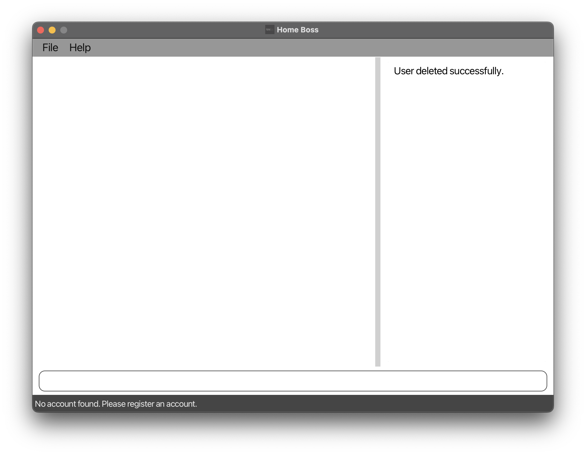
[&uarr; Back to Table of Contents](#table-of-contents)

## Customer

### Add a customer

> Adds a customer to the address book.

_Did you just receive a new customer? You can add the customer's details into HomeBoss with this command._

**Format:** `customer add --name NAME --phone PHONE_NUMBER --email EMAIL --address ADDRESS`

<box background-color="#dff0d8" border-color="#d6e9c6" type="info" header="Note">
    * All fields are required.
    * HomeBoss does not allow you to add customers with the same phone number.
</box>

**Example:** `customer add --name Gabriel --phone 87654321 --email gabrielrocks@gmail.com --address RVRC Block B`

**Before:**

**After:**
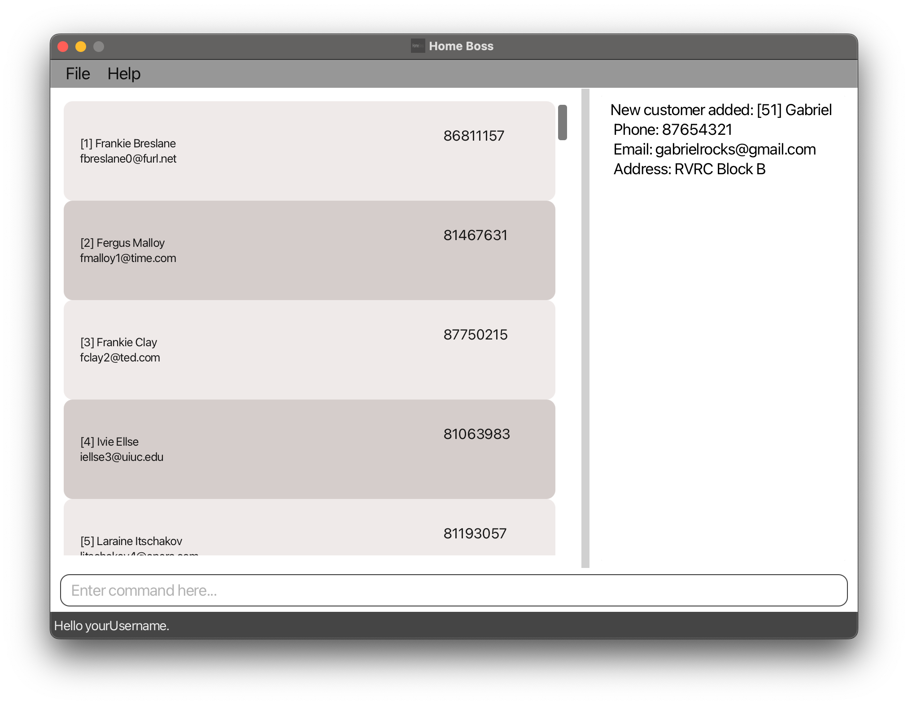
[&uarr; Back to Table of Contents](#table-of-contents)

### Find customers

> Finds customers whose names contain _ANY_ of the given keywords.

_Want to find details of a customer, but you do not remember the customer's full name?
You can search for the customer using keywords by calling this command._

**Format:** `customer find KEYWORD [MORE_KEYWORDS]`

<box background-color="#dff0d8" border-color="#d6e9c6" type="info" header="Note">
    You must provide at least one keyword to search for the customer.
</box>

**Example:** `customer find Gabriel Spencer`

**Before:**

**After:**
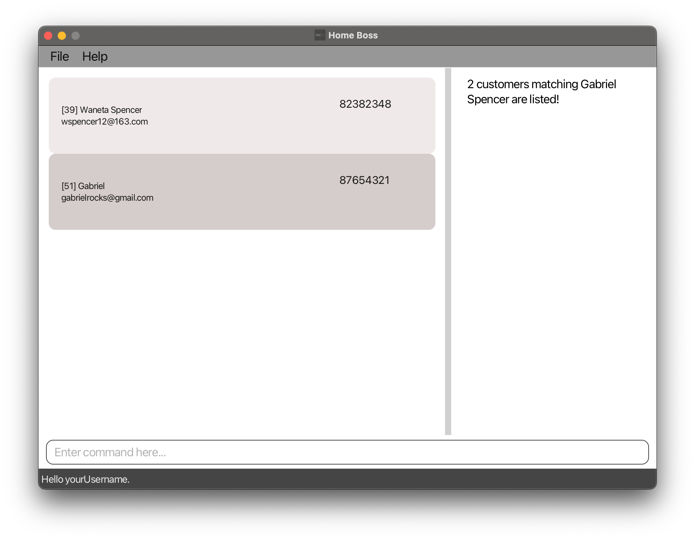
[&uarr; Back to Table of Contents](#table-of-contents)

### List customers

>Lists all the customers added in the address book.

Want to get an overview of all your customers in ONE list? Then, just use this feature to list all your customers at 
once.

**Format:** `customer list`
  
<box background-color="#d9edf7" border-color="#bce8f1" type="tip" header="Tip">
    You can frequently use this command together with `delivery list` to switch between the two lists.
</box>

[&uarr; Back to Table of Contents](#top)

### Update customer details
>Updates the personal details of an existing customer in the address book.

Did you accidentally key in the wrong details for a customer? Or perhaps your customer has changed his particulars? No
worries! You can  edit the details of a customer simply by calling this command.

**Format:** `customer edit CUSTOMER_ID [--name NAME] [--phone PHONE_NUMBER] [--email EMAIL] [--address ADDRESS]`

<box background-color="#dff0d8" border-color="#d6e9c6" type="info" header="Note">
    [!Note] [ ] around a parameter indicates that it is optional.
</box>

<box background-color="#f2dede" border-color="#ebccd1" type="warning" header="Warning">
    Be careful! You won't be able to undo this edit action! 
</box>

**Examples:**
- `customer edit 1 --name Gabriel -–phone 9813 1051`  
  Edits customer 1's name to Gabriel and phone to 9813 1051.
- `customer edit 2 --name Joe --email yangyang@gmail.com -–address Block 10 Tampines Road`  
  Edits customer 2's name to Joe, email to yangyang@gmail.com and address to Block 10 Tampines Road.\
  **Before:**
  
**After:**
  
  [&uarr; Back to Table of Contents](#top)

### Delete customer

> Deletes the specified customer from the customer database. All deliveries associated with the customer will also be
> deleted.

_Want to delete a customer? Call this command to delete a customer from the customer database._

**Format:** `customer delete CUSTOMER_ID`

**Example:** `customer delete 1`

<ins>Before

<ins>After
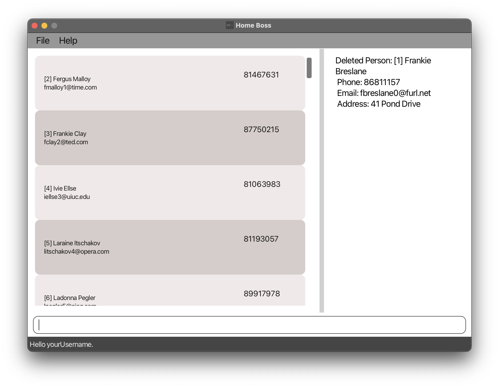
[&uarr; Back to Table of Contents](#table-of-contents)

## Delivery

### Add delivery

>Adds a delivery to the delivery book.

HomeBoss' most essential feature. The whole premise of our application is so that you can easily track your 
deliveries/orders. With this feature, you can do just that by adding a delivery to the delivery book.
  
<box background-color="#dff0d8" border-color="#d6e9c6" type="info" header="Note">
    Deliveries consist of a Delivery Name, a Customer ID, an Order Date, a Delivery Date, a Delivery Status and 
  an Address to ship to.    
  You don't have to fill in Order Date, Delivery Status and Address. Instead they will be initialised with these values: 
  
- Order Date: Today's date
- Delivery Status: CREATED
- Address: Customer's Address

Cool huh! We try to help you speed up the process as much as possible.
</box>
  
<box background-color="#dff0d8" border-color="#d6e9c6" type="info" header="Note">
    Delivery Status can be one of CREATED, SHIPPED, COMPLETED, CANCELLED.
</box>
 
**Format:** `delivery add DELIVERY_NAME --customer CUSTOMER_ID --date DELIVERY_DATE`

**Example:**
- `delivery add Chocolate Cake --customer 1 --date 2023-12-12`  
  Adds a delivery with Delivery Name Chocolate Cake, with the Customer who has Customer ID 1, with Delivery Date 
  of 2023-12-12, Order Date will be today's date, Delivery Status will be CREATED and Address will be the Customer's 
  Address. \
  **Before:**

  **After:**

[&uarr; Back to Table of Contents](#top)

### View all deliveries

Shows a list of all deliveries.

**Format:** `delivery list [--status STATUS] [--customer CUSTOMER_ID] [--date EXPECTED_DELIVERY_DATE]  [--sort SORT]`

**Example:** `delivery list --status created --customer 1 --date 2023-12-12 --sort desc`

**Accepted Values:**

_STATUS_: CREATED/SHIPPED/COMPLETED/CANCELLED. If unspecified, defaults to show all deliveries.

_CUSTOMER_ID_: Integer

_EXPECTED_DELIVERY_DATE_: Expected Delivery Date String in YYYY-MM-DD format or `today` for today’s date

_SORT_: String of either `asc` for ascending or `desc` for descending or defaults to sort by expected delivery date.

**Command succeeds (>0 deliveries):**
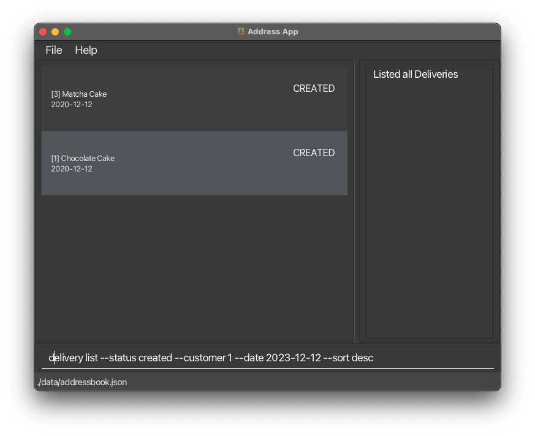

**Command failed (0 deliveries):** _There are currently no deliveries!_

### View details of deliveries

Shows the details of the specified delivery.

**Format:** `delivery view DELIVERY_ID`

**Example:** `delivery view 1001`

**Accepted Values:**

_DELIVERY_ID_: Integer

**Command succeeds:**

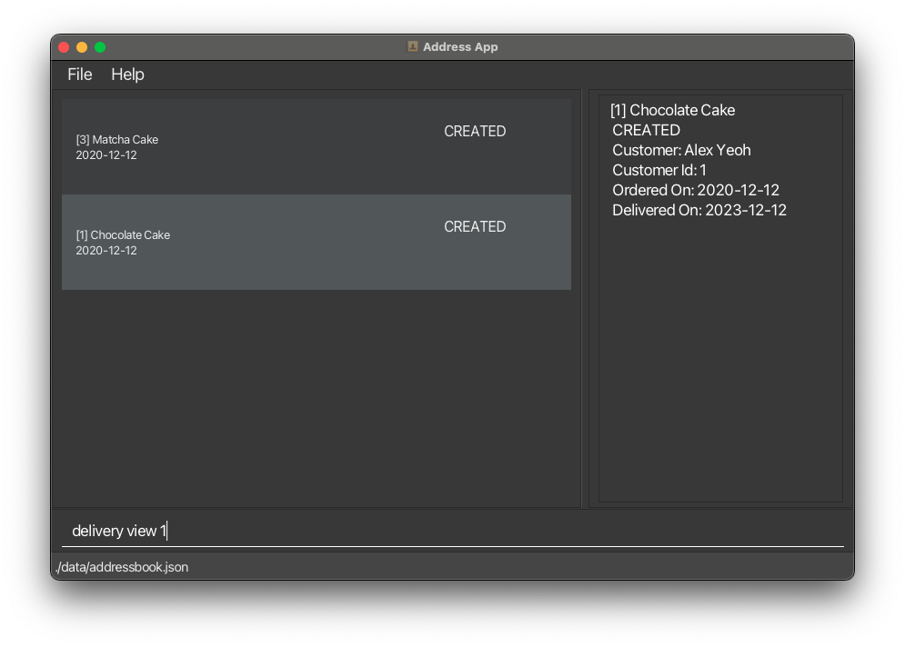

**Command failed (0 deliveries):** _There are currently no deliveries._

### Update delivery status

>Changes the status of a specified delivery to CREATED, SHIPPED, COMPLETED or CANCELLED

I see that you've just shipped out an order. Nice! Now you can update the status of that particular delivery 
to SHIPPED! Using this feature, you can update the status of a delivery accordingly.

<box background-color="#d9edf7" border-color="#bce8f1" type="tip" header="Tip">
    Delivery Status typed in need not be in uppercase.
</box>

**Format:** `delivery status CUSTOMER_ID STATUS`

**Examples:** 
- `delivery status 1 CANCELLED`
- `delivery status 2 SHIPPED`\
**Before:** 

**After:**

  

#### Update delivery details

>Updates the delivery details of an existing delivery in the delivery book.

Oh no! Did you key in the wrong details for a delivery? Or did your customer change some details to his 
delivery? No worries! Just edit the details of a delivery simply by using this feature.

**Format:** `delivery edit DELIVERY_ID [--name DELIVERY_NAME] [--customer CUSTOMER_ID] [--date EXPECTED_DELIVERY_DATE]
[--status STATUS] [--note NOTE]`

<box background-color="#d9edf7" border-color="#bce8f1" type="tip" header="Tip">
    If you only want to update the delivery's status, simply use `delivery status` instead.
</box>

<box background-color="#f2dede" border-color="#ebccd1" type="warning" header="Warning">
    Be careful! You won't be able to undo this edit action! 
</box>

**Examples:**
- `delivery edit 1 --status CANCELLED --note Sudden overseas business trip to attend to.`  
  Edits Delivery 1's Delivery Status to CANCELLED and edits the delivery's note. (If delivery previously did not 
  have a note, a note will be created to the delivery) 
- `delivery edit 2 --name Vanilla Cake --customer 3`  
Edits Delivery 2's name to Vanilla Cake as it was misspelled and edits the customer to Customer 3 as User 
  accidentally typed in 2 instead. \
  **Before:**

  **After:**
[Haven't merged yet] \
[&uarr; Back to Table of Contents](#top)

### Create a note for a delivery

Creates a note for a specified delivery

**Format:** `delivery note DELIVERY_ID --note NOTE`

**Example:** `delivery note 1 --note By FedEx`

**Accepted Values:**

_DELIVERY_ID_: Integer

_NOTE_: Nonempty alphanumeric string

**Command succeeds:**

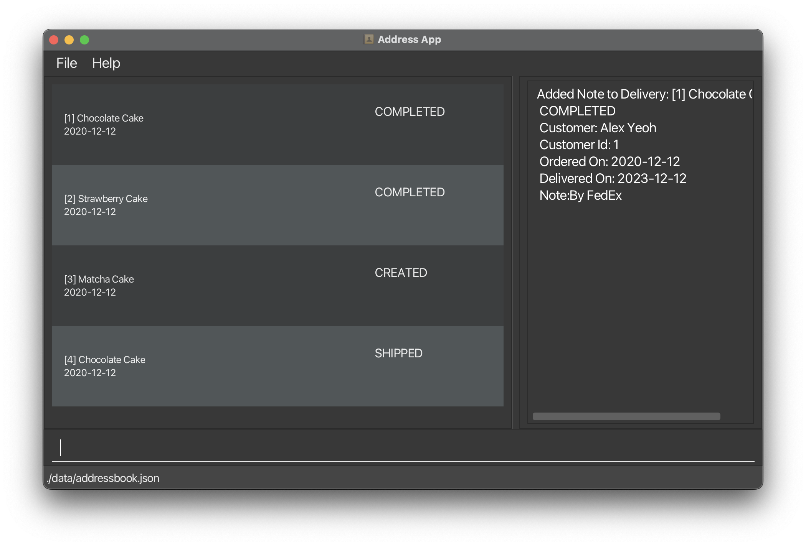

**Command failed (invalid_index):** _The delivery index provided is invalid_

**Command failed (invalid_note):** _Note should not be empty_

**Command failed (missing_fields):**

_Invalid command format!_ 
_delivery note: Adds a note to the delivery identified by the ID of the delivery. Existing note if any will be replaced
with the input note._ 
_Parameters: DELIVERY_ID (must be a integer representing a valid ID) --note Note_ 
_Example: delivery note 1 --note This is a note_ 

### Find deliveries
> Finds deliveries whose names has words that exactly match _ANY_ of the given keywords.

_Want to find details of a delivery, but you do not remember the delivery's full name?
You can search for the delivery using keywords by calling this command._

**Format:** `delivery find KEYWORD [MORE_KEYWORDS...]`{.swift}

<box background-color="#dff0d8" border-color="#d6e9c6" type="info" header="Note">

* You must provide at least one non-empty alphanumeric `KEYWORD`{.swift} to search for the delivery.
* You can optionally provide additional keywords, a delivery that matches any of the given keywords will be displayed.
  For example, the keywords `Chocolate Bun`{.swift} will display `Chocolate Cake`{.swift}, `Chocolate Bun`{.swift}, 
  and `Strawberry Cake`{.swift}.
* The keyword must exactly match any word in the delivery name. For example the keyword `Straw`{.swift} will match 
  `Straw`{.swift} but not `Strawberry`{.swift}.
* The search for keyword(s) given are case-insensitive

</box>

**Example:** 
`delivery find Chocolate Strawberry`{.swift}  
Find all deliveries whose name has words that exactly match `Chocolate`{.swift} or `Strawberry`{.swift}

**Before:**

**After:**
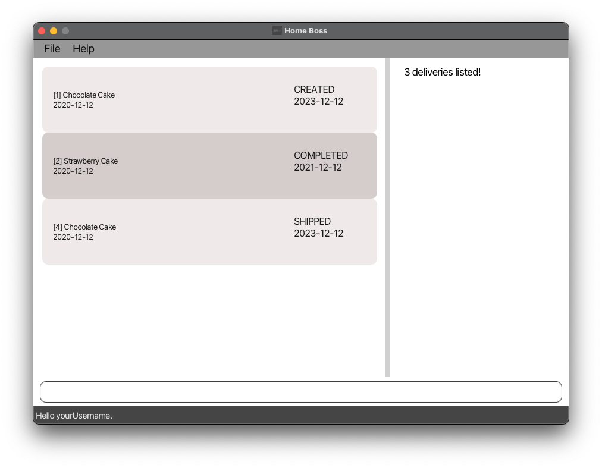

[&uarr; Back to Table of Contents](#table-of-contents)

### Delete delivery

>Deletes the specified delivery.

Feel like your delivery book is getting cluttered up? Maybe you just want to get rid of a few deliveries that have 
been cancelled or completed. If that's the case, simply use this feature to delete the delivery.

**Format:** `delivery delete DELIVERY_ID`

<box background-color="#f2dede" border-color="#ebccd1" type="warning" header="Warning">
    Be careful! This action is irreversible. Once deleted, the delivery cannot be recovered.
</box>

**Example:**
- `delivery delete 1`  
Deletes delivery 1 from the delivery book.
  **Before:**

  **After:** 

[&uarr; Back to Table of Contents](#top)

_Details coming soon..._

## Miscellaneous

### Help

> Shows a list of commands and their usage.

_Want to know what commands are available in HomeBoss? You can view a summary of the commands available, the format
of the commands, and a link to this user guide by calling this command._

**Format:** `help`

<box background-color="#d9edf7" border-color="#bce8f1" type="tip" header="Tip">
    You can access this command anytime when using the application, even when you are not logged in.
</box>

**Before:**

**After:**
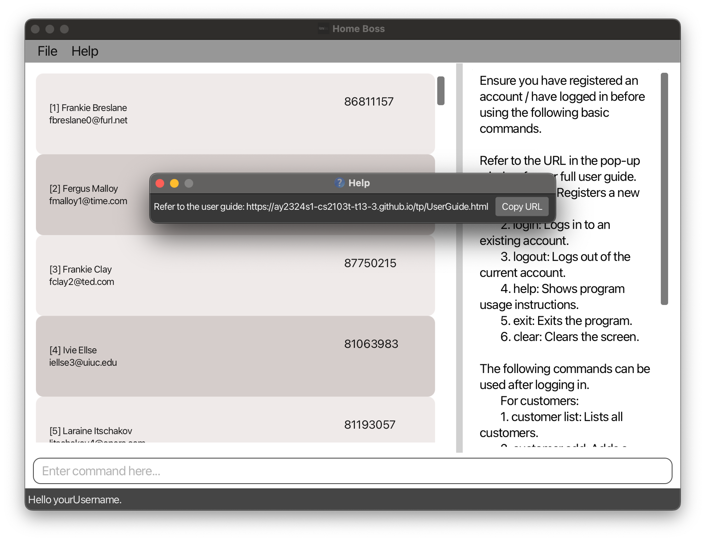
[&uarr; Back to Table of Contents](#table-of-contents)

### Exit

> Exits the program.

_Want to exit HomeBoss? You can exit the program by calling this command._

**Format:** `exit`

<box background-color="#dff0d8" border-color="#d6e9c6" type="info" header="Note">
    If you are logged in, this command will automatically log you out of your account and close the application.
</box>

[&uarr; Back to Table of Contents](#table-of-contents)

### Clear

> Clears both customer and delivery database.

_Need to clear your customer and delivery data?
You can delete all your customer and delivery data by calling this command._

**Format:** `clear`

<box background-color="#f2dede" border-color="#ebccd1" type="warning" header="Warning">
    This action is irreversible! All your customer and delivery data will be deleted permanently. Proceed with caution.
</box>

**Before:**

**After:**
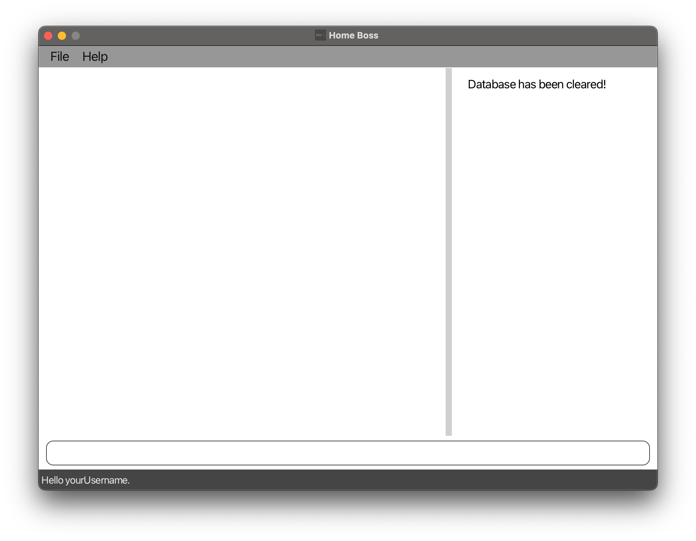
[&uarr; Back to Table of Contents](#table-of-contents)

