<span style="font-size: 3.3em; font-weight: 550;">HomeBoss User Guide</span>

---

# Introduction

Welcome to the _HomeBoss User Guide_! 

HomeBoss is a powerful desktop application designed specifically for **home-based business owners**, offering
**efficient Customer and Delivery management solutions**. HomeBoss streamlines your administrative
processes and elevate your overall business experience to new heights.

HomeBoss allows you to:

* Keep track of the details of your Customers and Deliveries
* Search for a particular Customer / Delivery easily
* Organise your data in a neat and tidy manner by filtering and sorting to your needs </br>
  and much more!

HomeBoss improves your efficiency and productivity in managing your Customers and Deliveries, all while
being incredibly simple to use.
HomeBoss is not only **tailored for fast typists**, leveraging a Command Line Interface (CLI) for **swift command
execution**, but it also features an elegant Graphical User Interface (GUI) that presents your data in a **more refined
and organized** fashion.

HomeBoss ensures that you **focus on what matters most: running your business.**


<div style="page-break-after: always;"></div><br/>

# Table of Contents

**&nbsp;&nbsp;1\. [Introduction](#introduction)</br>
&nbsp;&nbsp;2\. [Table of Contents](#table-of-contents)</br>
&nbsp;&nbsp;3\. [About this User Guide](#about-this-user-guide)</br>
&nbsp;&nbsp;4\. [Navigating the User Guide](#navigating-the-user-guide)</br>
&nbsp;&nbsp;5\. [Getting Started](#getting-started)</br>**
&nbsp;&nbsp;&nbsp;&nbsp;&nbsp;&nbsp;&nbsp;5.1. [Prerequisites](#prerequisites)</br>
&nbsp;&nbsp;&nbsp;&nbsp;&nbsp;&nbsp;&nbsp;5.2. [Installing HomeBoss](#installing-homeboss)</br>
&nbsp;&nbsp;&nbsp;&nbsp;&nbsp;&nbsp;&nbsp;5.3. [Understanding our layout](#understanding-our-layout)</br>
&nbsp;&nbsp;&nbsp;&nbsp;&nbsp;&nbsp;&nbsp;5.4. [HomeBoss Command Format](#homeboss-command-format)</br>
&nbsp;&nbsp;&nbsp;&nbsp;&nbsp;&nbsp;&nbsp;5.5. [Registering and creating your first Delivery](#registering-and-creating-your-first-delivery)</br>
&nbsp;&nbsp;&nbsp;&nbsp;&nbsp;&nbsp;&nbsp;5.6. [Editing the data files](#editing-the-data-files) </br>
**&nbsp;&nbsp;6\. [Feature Summary](#feature-summary)</br>**
&nbsp;&nbsp;&nbsp;&nbsp;&nbsp;&nbsp;&nbsp;6.1. [User features summary](#user-features-summary)</br>
&nbsp;&nbsp;&nbsp;&nbsp;&nbsp;&nbsp;&nbsp;6.2. [Customer features summary](#customer-features-summary)</br>
&nbsp;&nbsp;&nbsp;&nbsp;&nbsp;&nbsp;&nbsp;6.3. [Delivery features summary](#delivery-features-summary)</br>
&nbsp;&nbsp;&nbsp;&nbsp;&nbsp;&nbsp;&nbsp;6.4. [Miscellaneous features summary](#miscellaneous-features-summary)</br>
**&nbsp;&nbsp;7\. [Features](#features)</br>**
&nbsp;&nbsp;&nbsp;&nbsp;&nbsp;&nbsp;&nbsp;7.1. [User](#user)</br>
&nbsp;&nbsp;&nbsp;&nbsp;&nbsp;&nbsp;&nbsp;&nbsp;&nbsp;&nbsp;&nbsp;&nbsp;&nbsp;7.1.1. [Register](#register)</br>
&nbsp;&nbsp;&nbsp;&nbsp;&nbsp;&nbsp;&nbsp;&nbsp;&nbsp;&nbsp;&nbsp;&nbsp;&nbsp;7.1.2. [Login](#login)</br>
&nbsp;&nbsp;&nbsp;&nbsp;&nbsp;&nbsp;&nbsp;&nbsp;&nbsp;&nbsp;&nbsp;&nbsp;&nbsp;7.1.3. [Update Account details](#update-account-details)</br>
&nbsp;&nbsp;&nbsp;&nbsp;&nbsp;&nbsp;&nbsp;&nbsp;&nbsp;&nbsp;&nbsp;&nbsp;&nbsp;7.1.4. [Logout](#logout)</br>
&nbsp;&nbsp;&nbsp;&nbsp;&nbsp;&nbsp;&nbsp;&nbsp;&nbsp;&nbsp;&nbsp;&nbsp;&nbsp;7.1.5. [Recover Account](#recover-account)</br>
&nbsp;&nbsp;&nbsp;&nbsp;&nbsp;&nbsp;&nbsp;&nbsp;&nbsp;&nbsp;&nbsp;&nbsp;&nbsp;7.1.6. [Delete Account](#delete-account)</br>
&nbsp;&nbsp;&nbsp;&nbsp;&nbsp;&nbsp;&nbsp;7.2. [Customer](#customer)</br>
&nbsp;&nbsp;&nbsp;&nbsp;&nbsp;&nbsp;&nbsp;&nbsp;&nbsp;&nbsp;&nbsp;&nbsp;&nbsp;7.2.1. [Add a Customer](#add-a-customer)</br>
&nbsp;&nbsp;&nbsp;&nbsp;&nbsp;&nbsp;&nbsp;&nbsp;&nbsp;&nbsp;&nbsp;&nbsp;&nbsp;7.2.2. [View details of a Customer](#view-details-of-a-customer)</br>
&nbsp;&nbsp;&nbsp;&nbsp;&nbsp;&nbsp;&nbsp;&nbsp;&nbsp;&nbsp;&nbsp;&nbsp;&nbsp;7.2.3. [View a list of Customers](#view-a-list-of-customers)</br>
&nbsp;&nbsp;&nbsp;&nbsp;&nbsp;&nbsp;&nbsp;&nbsp;&nbsp;&nbsp;&nbsp;&nbsp;&nbsp;7.2.4. [Find Customers](#find-customers)</br>
&nbsp;&nbsp;&nbsp;&nbsp;&nbsp;&nbsp;&nbsp;&nbsp;&nbsp;&nbsp;&nbsp;&nbsp;&nbsp;7.2.5. [Update details of a Customer](#update-details-of-a-customer)</br>
&nbsp;&nbsp;&nbsp;&nbsp;&nbsp;&nbsp;&nbsp;&nbsp;&nbsp;&nbsp;&nbsp;&nbsp;&nbsp;7.2.6. [Delete a Customer](#delete-a-customer)</br>
&nbsp;&nbsp;&nbsp;&nbsp;&nbsp;&nbsp;&nbsp;7.3. [Delivery](#delivery)</br>
&nbsp;&nbsp;&nbsp;&nbsp;&nbsp;&nbsp;&nbsp;&nbsp;&nbsp;&nbsp;&nbsp;&nbsp;&nbsp;7.3.1. [Add a Delivery](#add-a-delivery)</br>
&nbsp;&nbsp;&nbsp;&nbsp;&nbsp;&nbsp;&nbsp;&nbsp;&nbsp;&nbsp;&nbsp;&nbsp;&nbsp;7.3.2. [View details of a Delivery](#view-details-of-a-delivery)</br>
&nbsp;&nbsp;&nbsp;&nbsp;&nbsp;&nbsp;&nbsp;&nbsp;&nbsp;&nbsp;&nbsp;&nbsp;&nbsp;7.3.3. [View a list of Deliveries](#view-a-list-of-deliveries)</br>
&nbsp;&nbsp;&nbsp;&nbsp;&nbsp;&nbsp;&nbsp;&nbsp;&nbsp;&nbsp;&nbsp;&nbsp;&nbsp;7.3.4. [Find Deliveries](#find-deliveries)</br>
&nbsp;&nbsp;&nbsp;&nbsp;&nbsp;&nbsp;&nbsp;&nbsp;&nbsp;&nbsp;&nbsp;&nbsp;&nbsp;7.3.5. [Update details of a Delivery](#update-details-of-a-delivery)</br>
&nbsp;&nbsp;&nbsp;&nbsp;&nbsp;&nbsp;&nbsp;&nbsp;&nbsp;&nbsp;&nbsp;&nbsp;&nbsp;7.3.6. [Update status of a Delivery](#update-status-of-a-delivery)</br>
&nbsp;&nbsp;&nbsp;&nbsp;&nbsp;&nbsp;&nbsp;&nbsp;&nbsp;&nbsp;&nbsp;&nbsp;&nbsp;7.3.7. [Create a note for a Delivery](#create-a-note-for-a-delivery)</br>
&nbsp;&nbsp;&nbsp;&nbsp;&nbsp;&nbsp;&nbsp;&nbsp;&nbsp;&nbsp;&nbsp;&nbsp;&nbsp;7.3.8. [Delete a Delivery](#delete-a-delivery)</br>
&nbsp;&nbsp;&nbsp;&nbsp;&nbsp;&nbsp;&nbsp;7.4. [Miscellaneous](#miscellaneous)</br>
&nbsp;&nbsp;&nbsp;&nbsp;&nbsp;&nbsp;&nbsp;&nbsp;&nbsp;&nbsp;&nbsp;&nbsp;&nbsp;7.4.1. [Help](#help)</br>
&nbsp;&nbsp;&nbsp;&nbsp;&nbsp;&nbsp;&nbsp;&nbsp;&nbsp;&nbsp;&nbsp;&nbsp;&nbsp;7.4.2. [Exit](#exit)</br>
&nbsp;&nbsp;&nbsp;&nbsp;&nbsp;&nbsp;&nbsp;&nbsp;&nbsp;&nbsp;&nbsp;&nbsp;&nbsp;7.4.3. [Clear](#clear)</br>
**&nbsp;&nbsp;8\. [FAQ](#faq)</br>**
**&nbsp;&nbsp;9\. [Command Summary](#command-summary)</br>**

<div style="page-break-after: always;"></div><br/>

# About this User Guide

This user guide provides in-depth documentation on HomeBoss' installation process, explanation of its graphical components, the structure of the commands and features available to the User. In addition, this guide also provides troubleshooting tips and answers to frequently asked questions.

If you are new to HomeBoss, head over to the [Getting Started](#getting-started) section for a quick overview
on how to get started. 

You can find detailed explanations of all the features available in the [Features](#features) section.

For experienced users, you may refer to the [Command Summary](#command-summary) section for a quick summary of all the
commands available in HomeBoss.

If you would like to learn about the technical aspects of HomeBoss,
you may refer to the [Developer Guide](./DeveloperGuide.md).

<br/>

[&uarr; Back to Table of Contents](#table-of-contents)

<div style="page-break-after: always;"></div><br/>

# Navigating the User Guide

**Warning Box**

<box type="warning" background-color="#f2dede" border-color="#ebccd1" icon=":exclamation:">

**Warning:** Provides you with important information to take note of to avoid any unintended effects!

</box>

<br/>

**Note Box**

<box type="note" background-color="#dff0d8" border-color="#d6e9c6" icon=":information_source:">

**Note:** Provides you with information that is useful to know.

</box>

<br/>

**Tip Box**

<box type="tip" background-color="#d9edf7" border-color="#bce8f1" icon=":bulb:">

**Tip(s):** Provides you with information that can help enhance your user experience but is not necessary to know.

</box>

<br/>

**Parameter Box**

<box type="info" background-color="#fcf8e3" border-color="#fcf8ff" icon=":gear:">

**Parameter(s):** Parameters are inputs that you can customise to your needs. They are typically preceded by a prefix.
If you're unsure what a prefix is, you can refer to the [HomeBoss Command Format](#homeboss-command-format) section.

</box>

<br/>

**Links**

* Words in blue are [links](#navigating-the-user-guide) that you can click on to navigate to the relevant section. <br/><br/>

* A [&uarr; Back to Table of Contents](#table-of-contents) link is available at the end of every section
  for you to return to the Table of Contents, so that you can access another section from there easily. <br/>

<div style="page-break-after: always;"></div><br/>

**Syntax Highlighting**

* Words in `code COLOUR`{.swift} represent the command format that you should use when entering commands into HomeBoss.
  <br/><br/>

* Words in `code NORMAL` represent actual words that you can enter into HomeBoss. <br/><br/>

**Screenshots**

* Screenshots are added below each example where it helps enhance the clarity of the **expected outcome** from running the command that precedes it. <br/><br/>

* Whereever the explanation that follows each command is sufficient to convey the expected outcome, screenshots are omitted to reduce clutter. <br/>

<br/>

[&uarr; Back to Table of Contents](#table-of-contents)

<div style="page-break-after: always;"></div><br/>

# Getting Started

## <span style="text-decoration:underline; font-size:29px"><strong>Prerequisites</strong></span>

Ensure that you have `Java 11` or above installed on your computer. If you are unsure how to do so you may view
this
helpful [guide](https://www.java.com/en/download/help/version_manual.html).

<br/>

<box type="tip" background-color="#d9edf7" border-color="#bce8f1" icon=":bulb:">

**Tip**: You may find the following links helpful should you need to install `Java 11` :

1. [Java 11 Release](https://www.oracle.com/java/technologies/downloads/#java11)
2. [Java 11 Installation Guide](https://docs.oracle.com/en/java/javase/11/install/overview-jdk-installation.html#GUID-8677A77F-231A-40F7-98B9-1FD0B48C346A)

</box>

<br/>

[&uarr; Back to Table of Contents](#table-of-contents)

<div style="page-break-after: always;"></div>

## </br><span style="text-decoration:underline; font-size:29px"><strong>Installing HomeBoss</strong></span>

1. You may download the latest release of **HomeBoss**
   from [here](https://github.com/AY2324S1-CS2103T-T13-3/tp/releases/latest).
   (Please download the file named `HomeBoss.jar`)

2. Move the downloaded `HomeBoss.jar` file into the folder that you want to use as the home folder for your
   application.

<br/> 

<box type="warning" background-color="#f2dede" border-color="#ebccd1" icon=":exclamation:">

**Warning**: The folder that you would like to use as the home folder for HomeBoss must be empty and should not contain
any other
files / folders before the application is launched for the first time.

</box>

<br/> 

3. Run `HomeBoss.jar`. If you are unsure of how to run a `.jar` file, you may refer to this helpful
   [guide](https://www.theserverside.com/blog/Coffee-Talk-Java-News-Stories-and-Opinions/Run-JAR-file-example-windows-linux-ubuntu).

4. If everything went well, you will be greeted by a window similar to the one shown below.

5. If you are a first time user, we highly recommend reading the following sections to familiarise yourself with
   HomeBoss's layout and commands:

* [Understanding our layout](#understanding-our-layout)
  
* [HomeBoss Command Format](#homeboss-command-format)
  
* [Registering and creating your first Delivery](#registering-and-creating-your-first-delivery)

<!--  -->
<div style="text-align:center">
  
</div>

[&uarr; Back to Table of Contents](#table-of-contents)

<div style="page-break-after: always;"></div>

## </br><span style="text-decoration:underline; font-size:29px"><strong>Understanding our layout</strong></span>

Do not worry if the layout looks unfamiliar at first glance. Let's go through a quick run down of HomeBoss's layout
so that you can familiarise yourself with our various components.

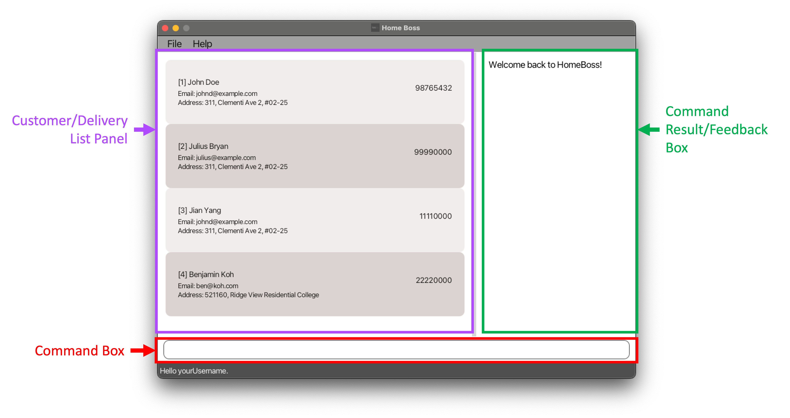

<box type="note" background-color="#dff0d8" border-color="#d6e9c6" icon=":information_source:">

**Note**: The above image is an example with sample data and may not be what you see when you launch
the application for the first time.

</box>

<div style="page-break-after: always;"></div>

### <br/>Command Box

{style="display: block; margin: 0 auto;"}

The Command Box is where you will be interacting with HomeBoss, it is the place where all commands
will be entered. Try typing the `help`{.swift} command and hitting enter!

### </br>Command Result / Feedback

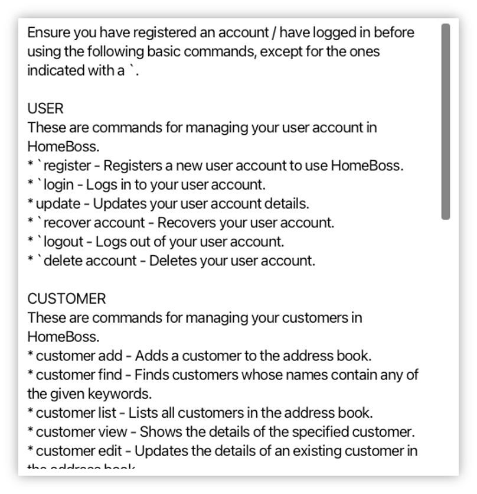{style="display: block; margin: 0 auto; width: 60%;}

The Command Result / Feedback Box is where HomeBoss will provide you the results or feedback about
the commands you entered. For example, if you tried typing the `help`{.swift} command earlier, you should see
the above feedback in your application window, together with a Help window popup.
You can use the scroll bar on the right to scroll through a long result or feedback!

<div style="page-break-after: always;"></div>

### </br>Customer / Delivery List

<table class="images" style="border:0px solid white; width:100%; text-align: center">
    <tr style="width:100%;border: 0;">
        <td>
            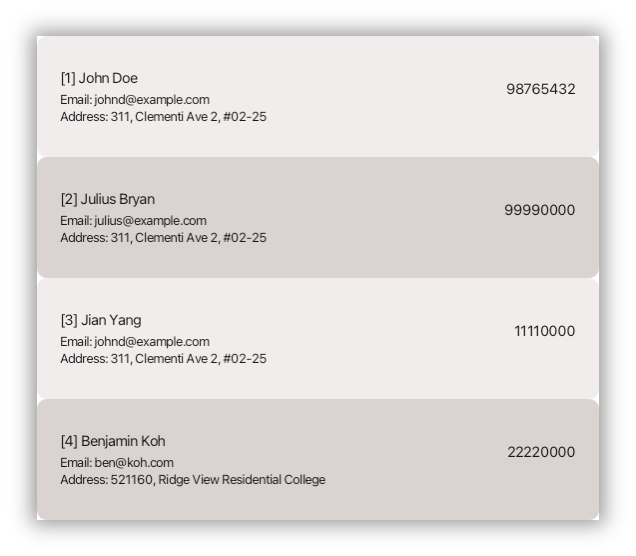
        </td>
        <td>
            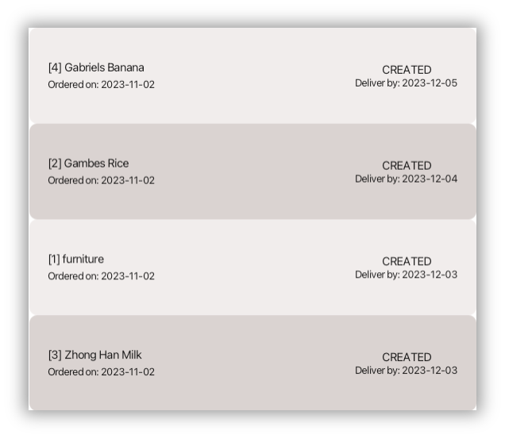
        </td>
    </tr>
    <tr >
        <td style="padding-top: 10px; padding-bottom: 20px"><i>List of Customers</i></td>
        <td style="padding-top: 10px; padding-bottom: 20px"><i>List of Deliveries</i></td>
    </tr>
</table>

The Customer / Delivery List Panel is where you will be able to find the Customers and Deliveries that you have added to
HomeBoss. You can use the scroll bar on the right to scroll through your Customers or Deliveries.

<br/>

<box type="note" background-color="#dff0d8" border-color="#d6e9c6" icon=":information_source:">

**Note**:

* The `ID`{.swift} that appears next to each name is a unique identifier given to all added Customers and
  Deliveries separately, and is required to perform many of HomeBoss's commands.
  More details of these commands can be found in [Features](#features). <br/><br/>

* The `ID`{.swift}s generated are guaranteed to be unique but may not be consecutive and may not start from 1.<br/>

{style="display: block; margin: 0 auto;"}

</box>

<br/>

[&uarr; Back to Table of Contents](#table-of-contents)

<div style="page-break-after: always;"></div>

## </br><span style="text-decoration:underline; font-size:29px"><strong>HomeBoss Command Format</strong></span>

Commands are your main form of interaction with HomeBoss, and is the way to carry out various operations in HomeBoss.
Don't worry if the commands seem daunting, the HomeBoss team has carefully crafted the commands to be as intuitive
and simple as possible. After learning the commands, you'll be faster than ever!

Every command has a **Command Phrase** and possibly one or more **Parameters**
(inputs to customise the command to your needs) which is typically preceded by a **Prefix**
(special markers for HomeBoss to understand your inputs)

Take the [Add a Delivery](#add-a-delivery) command for example:

```swift
delivery add DELIVERY_NAME --customer CUSTOMER_ID --date EXPECTED_DELIVERY_DATE
```

* The **Command Phrase** is `delivery add`{.swift}.
* The **Parameters** are the words in uppercase, for example `DELIVERY_NAME`{.swift} or `CUSTOMER_ID`{.swift}.
* The **Prefixes** are special keywords that are preceded by `--`{.swift}, such as `--customer`{.swift} and<br/>
  `--date`{.swift}.

<br />

However, not all commands have **Prefixes**. Take the
[Update status of a Delivery](#update-status-of-a-delivery) command as example:

```swift
delivery status DELIVERY_ID STATUS
```

* The **Command Phrase** is `delivery status`{.swift}.
* The **Parameters** are `DELIVERY_ID`{.swift} and `STATUS`{.swift}.
* It has no **Prefixes**.

<br />

Not all commands have **Parameters** as well. Take the
[Logout](#logout) command as example:

```swift
logout
```

* The **Command Phrase** is `logout`{.swift}.
* It has no **Parameters**.

<div style="page-break-after: always;"></div>

<br/>

<box type="note" background-color="#dff0d8" border-color="#d6e9c6" icon=":information_source:">

**Note**:

* If Customer ID or Delivery ID is specified in the command, it must be a positive integer for the Command Format to be
  considered valid.
* A Command Phrase is made up of keywords or short phrases that are unique to each Command.
* Words in uppercase are parameters that are supplied by you.
* Parameters that are preceded by a prefix must be supplied after that prefix.<br/>e.g. `--name DELIVERY_NAME`{.swift}
  must be given as `--name furniture` and not `furniture` or `--name`.
* Items that are placed in square brackets (`[]`{.swift}) are optional. <br/>e.g. `DELIVERY_ID [--name DELIVERY_NAME]`{.swift} can either be `1` or <br/>`1 --name furniture`.
* However, items that are grouped together in square brackets (`[]`{.swift}) must all be provided together.
  <br/>e.g. for `[--password PASSWORD --confirmPass CONFIRM_PASSWORD]`{.swift} both `PASSWORD`{.swift} and
  `CONFIRM_PASSWORD`{.swift} must be provided.
* Extraneous parameters for commands without parameters, like `customer list`{.swift} or `clear`{.swift}, will be disregarded. <br/>e.g. `customer list 123` will be treated as `customer list`.
* Parameters that have `...`{.swift} as a postfix can be given one or more times.<br/>e.g. `KEYWORDS...`{.swift} can be
  given as `Keyword` or `Keyword AnotherKeyword`.
* **Command Phrase** and **Prefixes** are **case-sensitive**! <br/>e.g. `clear`{.swift} is a valid command word but
  `customer LIST` is not a valid command word.
* Leading and trailing whitespaces of parameters will be trimmed.<br/>e.g. spaces added between `--password`{.swift}
  and `PASSWORD`{.swift} in `--password PASSWORD`{.swift} will be removed.

  </box>

<br/>

[&uarr; Back to Table of Contents](#table-of-contents)

<div style="page-break-after: always;"></div>

## <br/><span style="text-decoration:underline; font-size:29px"><strong>Registering and creating your first Delivery</strong></span>

At this juncture, you should already have a good understanding of the basic mechanisms of HomeBoss. Let's now get you
started on HomeBoss
by creating your first Delivery.

1. Let's first register for HomeBoss using the `register`{.swift} command. Suppose you want to register an account
   with the following details:

* `USERNAME`{.swift} : yourUsername
* `PASSWORD`{.swift} : AlexIsGreat
* `CONFIRM_PASSWORD`{.swift} : AlexIsGreat
* `SECRET_QUESTION`{.swift} : First Pet Name?
* `ANSWER`{.swift} : Koko

Type `register --user yourUsername --password AlexIsGreat --confirmPass AlexIsGreat --secretQn First Pet Name?
--answer Koko` into the Command Box and hit enter. More details on the `register` command can be
found [here](#register).

<br/>


<box type="note" background-color="#dff0d8" border-color="#d6e9c6" icon=":information_source:">

**Note**: Only 1 account can be registered in HomeBoss at any one time.

</box>

<br/>

2. After registering for an account, you will be greeted by HomeBoss's home page. It's empty at the moment, so let's
   populate it with some data.

3. Let's now add a new Customer, `Gabriel`, to HomeBoss' Customer database using the `customer add`{.swift} command with the following details:

* `NAME`{.swift} : Gabriel
* `PHONE`{.swift} : 87654321
* `EMAIL`{.swift} : gabrielrocks@gmail.com
* `ADDRESS`{.swift} : RVRC Block B

4. Type `customer add --name Gabriel --phone 87654321 --email gabrielrocks@gmail.com --address RVRC Block B`
   into the Command Box and hit enter.

<div style="page-break-after: always;"></div><br/>

5. A new Customer called `Gabriel` will be added, and you will see the Customer's details reflected in the Customer List
   panel, similar to the image shown below.

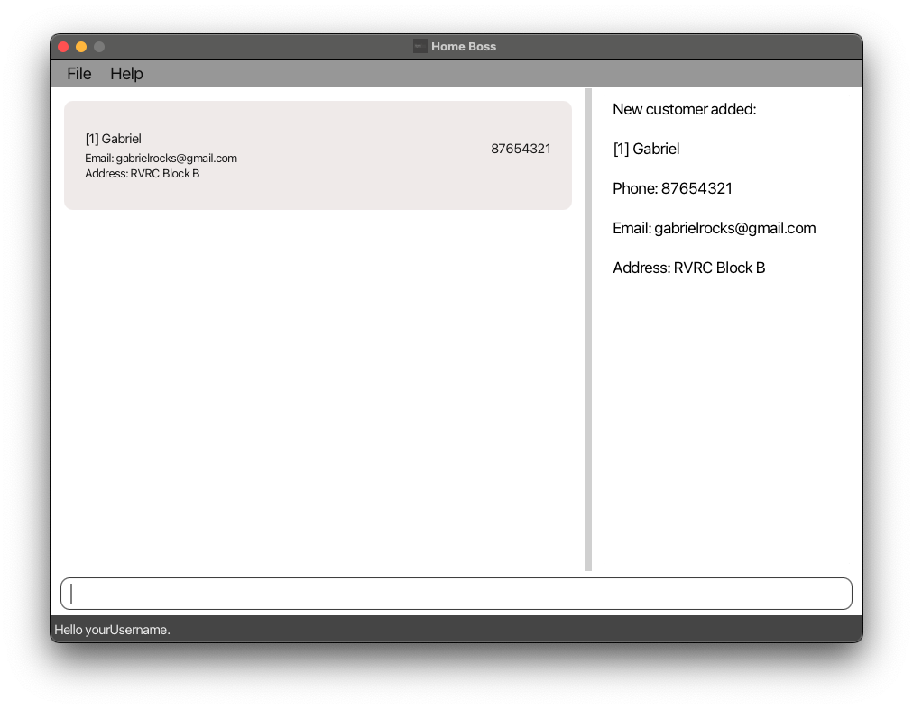{style="display: block; margin: 0 auto;"}

6. Now, let's add a new Delivery for `Gabriel` into HomeBoss' Delivery database. For this example, `Gabriel` has just
   ordered a `MacBook Pro` from you, and the Delivery date that you expect to deliver to him by is `2023-12-03`.

* `DELIVERY_NAME`{.swift} : MacBook Pro
* `EXPECTED_DELIVERY_DATE`{.swift} : 2023-12-03

7. Type `delivery add MacBook Pro --customer CUSTOMER_ID --date 2023-12-03`, replacing `CUSTOMER_ID`{.swift}
   with Gabriel's ID, and hit enter.

<div style="page-break-after: always;"></div>

8. A new Delivery should have been added for `Gabriel`, you should see a new Delivery in the Delivery List Panel,
   similar to the image shown below.

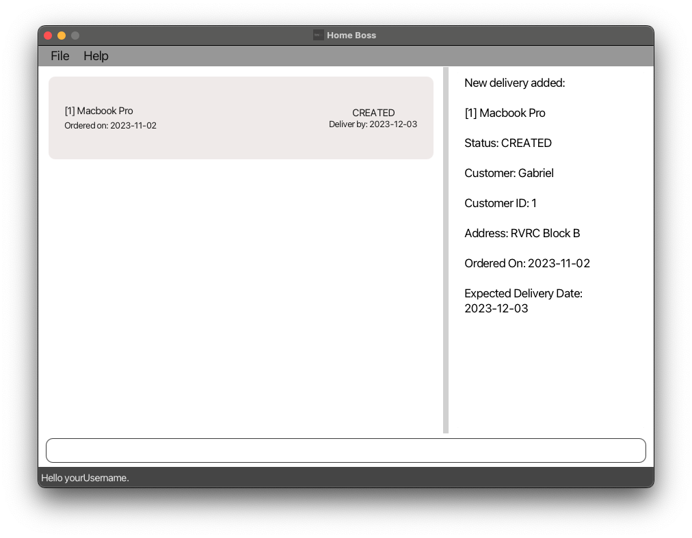{style="display: block; margin: 0 auto;"}

Congratulations! You have just successfully added your first Customer and Delivery!

HomeBoss is packed with many more features to help you manage your Customers and Deliveries.
Check them out under the [Features](#features) section to learn more!

<br/>

[&uarr; Back to Table of Contents](#table-of-contents)

<div style="page-break-after: always;"></div>

## <br/><span style="text-decoration:underline; font-size:29px"><strong>Editing the data files</strong></span>

HomeBoss stores your data in three JSON files,
namely
* `[JAR file location]/data/authentication.json` (containing the authentication data)
* `[JAR file location]/data/addressbook.json` (containing the
Customer database)
* `[JAR file location]/data/deliverybook.json` (containing the Delivery database).

Advanced users are welcome to update the data by editing the data files directly. However, please note that we do not provide support for any issues that arise from this.

<br/>

<box type="warning" background-color="#f2dede" border-color="#ebccd1" icon=":exclamation:">

**Warning:** 
* If either the `addressbook.json` or `deliverybook.json` data file is edited and contain invalid data as a
result, HomeBoss will discard the entire data file
and start with an empty data file on the next application run. 

  * If `deliverybook.json` contains invalid data while
the `addressbook.json` remains untouched and valid, the Customer database will remain unaffected.

   * On the other hand, if `addressbook.json` contains invalid data, regardless of the validity of the data in `deliverybook.json`, both the Customer and Delivery database will be completely reset on the next application run since the Delivery database is dependent on the Customer database.

* It's not recommended to edit the `authentication.json` data file directly as it may result in the inability to log in to your account and other unintended effects.

</box>

<br/>

[&uarr; Back to Table of Contents](#table-of-contents)

<div style="page-break-after: always;"></div><br/>

# Feature Summary

Here is a brief introduction to all the features in HomeBoss. For more detailed information, please
refer to the [Features](#features) section.

## <span style="text-decoration:underline; font-size:29px"><strong>User features summary</strong></span>

_These are features for managing your user account in HomeBoss._

- `register` - Registers a new user account to use HomeBoss.
- `login` - Logs in to your user account.
- `update` - Updates your user account details.
- `recover account` - Recovers your user account.
- `logout` - Logs out of your user account.
- `delete account` - Deletes your user account.

## </br><span style="text-decoration:underline; font-size:29px"><strong>Customer features summary</strong></span>

_These are features for managing your Customers in HomeBoss._

- `customer add` - Adds a Customer to the Customer database.
- `customer view` - Shows the details of the specified Customer.
- `customer list` - Lists all Customers in the Customer database.
- `customer find` - Finds Customers whose names contain words that exactly match any of the given keywords.
- `customer edit` - Updates the details of an existing Customer in the Customer database.
- `customer delete` - Deletes the specified Customer from the Customer database.

## <br/><span style="text-decoration:underline; font-size:29px"><strong>Delivery features summary</strong></span>

_These are features for managing your Deliveries in HomeBoss._

- `delivery add` - Adds a Delivery to the Delivery database.
- `delivery view` - Shows the details of the specified Delivery.
- `delivery list` - Lists Deliveries in the Delivery database according to the specified conditions.
- `delivery find` - Finds Deliveries with names containing words that exactly match any of the given keywords.
- `delivery edit` - Updates the details of an existing Delivery in the Delivery database.
- `delivery status` - Updates the status of a specified Delivery.
- `delivery note` - Creates a note for a specified Delivery.
- `delivery delete` - Deletes the specified Delivery from the Delivery database.

<div style="page-break-after: always;"></div>

## </br><span style="text-decoration:underline; font-size:29px"><strong>Miscellaneous features summary</strong></span>

_These are general features in HomeBoss._

- `exit` - Exits the program.
- `help` - Shows a list of commands and their usage.
- `clear` - Clears both Customer and Delivery database.

<br/>

[&uarr; Back to Table of Contents](#table-of-contents)

<div style="page-break-after: always;"></div><br/>

# Features

## <span style="text-decoration:underline; font-size:29px"><strong>User</strong></span>

### Register

You can register for a new user account with HomeBoss by calling this command.

<br />

<box type="note" background-color="#dff0d8" border-color="#d6e9c6" icon=":information_source:">

**Note:** Only one account can be registered at any one time.

</box>

</br>**Format:**

`register --user USERNAME --password PASSWORD --confirmPass CONFIRM_PASSWORD --secretQn SECRET_QUESTION --answer ANSWER`{.swift}


<br/>

<box type="info" background-color="#fcf8e3" border-color="#fcf8ff" icon=":gear:">

**Parameters:**

* `USERNAME`{.swift} must be alphanumeric.<br/><br/>
* `PASSWORD`{.swift} must be at least 8 alphanumeric characters long.<br/><br/>
* `CONFIRM_PASSWORD`{.swift} must be the same as `PASSWORD`{.swift}.<br/><br/>
* `SECRET_QUESTION`{.swift} can include any characters but must not be empty.<br/><br/>
* `ANSWER`{.swift} can include any characters but must not be empty.<br/><br/>
* `SECRET_QUESTION`{.swift} and `ANSWER`{.swift} will be used for account recovery.<br/><br/>
* Verification of the correct format of `PASSWORD`{.swift} and `CONFIRM_PASSWORD`{.swift} will precede the check for equality of passwords.<br/>

</box>

</br>**Example:**

* `register --user yourUsername --password GabrielIsGreat --confirmPass GabrielIsGreat --secretQn First Pet Name? --answer Koko`</br>

<box type="neutrality" seamless>

  **Explanation**

  This registers a new user account with the username `yourUsername`, password `GabrielIsGreat`, secret
  question `First Pet Name?` and answer `Koko`.

  <br/>**Expected Outcome**


  ```
    Registration successful. 
    
    
    Welcome to HomeBoss!
  ```
</box>


<br/>

<box type="tip" background-color="#d9edf7" border-color="#bce8f1" icon=":bulb:">

**Tip:** Since only one account can be registered at any one time, if you have already registered an account, you will
not be able to register another account. If you must, you can delete your current account by using the `delete account`{.swift} command [here](#delete-account) before registering a new account.
</box>

<br/>

[&uarr; Back to Table of Contents](#table-of-contents)
</br>

### </br></br>Login

You can log in to your account to access your Customer and Delivery data by calling this command.

<br />

<box type="note" background-color="#dff0d8" border-color="#d6e9c6" icon=":information_source:">

**Note:** You need to already have an account registered with HomeBoss.

</box>


</br>**Format:**

`login --user USERNAME --password PASSWORD`{.swift}

<br/>

<box type="info" background-color="#fcf8e3" border-color="#fcf8ff" icon=":gear:">

**Parameters:**

* `USERNAME`{.swift} must be alphanumeric.<br/><br/>
* `PASSWORD`{.swift} must be at least 8 alphanumeric characters long.<br/>

</box>

<div style="page-break-after: always;"></div><br/>

</br>**Example:**

* `login --user yourUsername --password GabrielIsGreat` </br>

  Logs in to the user account with the username `yourUsername` and password `GabrielIsGreat`.

<br/>**Expected Outcome:**


</br>

[&uarr; Back to Table of Contents](#table-of-contents)

<div style="page-break-after: always;"></div>

### </br>Update Account details

This command allows you to update your account details, thus enabling greater security and personalisation.

<br />

<box type="note" background-color="#dff0d8" border-color="#d6e9c6" icon=":information_source:">

**Note:** The details will be updated without checking against the current details.

</box>

</br>**Format:**

`update [--user USERNAME] [--password PASSWORD --confirmPass CONFIRM_PASSWORD]
[--secretQn SECRET_QUESTION --answer ANSWER]`{.swift}

<br/>

<box type="info" background-color="#fcf8e3" border-color="#fcf8ff" icon=":gear:">

**Parameters:**

* At least one of the optional fields must be provided.<br/><br/>
* `USERNAME`{.swift} must be alphanumeric.<br/><br/>
* `PASSWORD`{.swift} must be at least 8 alphanumeric characters long.<br/><br/>
* `CONFIRM_PASSWORD`{.swift} must be the same as `PASSWORD`{.swift}.<br/><br/>
* `SECRET_QUESTION`{.swift} can take any characters.<br/><br/>
* `ANSWER`{.swift} can take any characters.<br/><br/>
* Verification of the correct format of `PASSWORD`{.swift} and `CONFIRM_PASSWORD`{.swift} will precede the check for
  equality of passwords.<br/>

</box>

</br>**Example:**

* `update --user GabrielV2 --password GabrielIsBest --confirmPass GabrielIsBest
  --secretQn Favourite Pet --answer BoBo` </br>

  Updates the username to `GabrielV2`, password to `GabrielIsBest`,
  secret question to `Favourite Pet` and answer to `BoBo`.

<br/>

[&uarr; Back to Table of Contents](#table-of-contents)

<div style="page-break-after: always;"></div><br/>

### Logout

You can log out of your account to keep your data secure at the end of the day by calling this command.

<br/>

**Format:** `logout`{.swift}

<br/>

[&uarr; Back to Table of Contents](#table-of-contents)

### Recover Account

HomeBoss makes it easy for you to recover your account if you forget your password. You only need the answer to the
secret question (set during account registration) to reset your password and thus regain access to your account.

</br>**Format:**

`recover account [--answer ANSWER --password NEW_PASSWORD --confirmPass CONFIRM_PASSWORD]`{.swift}

<br />

<box type="info" background-color="#fcf8e3" border-color="#fcf8ff" icon=":gear:">

**Parameters:**

* If `ANSWER`{.swift} is provided, `NEW_PASSWORD`{.swift} and `CONFIRM_PASSWORD`{.swift} must also be provided and vice
  versa.<br/><br/>
* `ANSWER`{.swift} can take any characters.<br/><br/>
* `NEW_PASSWORD`{.swift} must be at least 8 alphanumeric characters long.<br/><br/>
* `CONFIRM_PASSWORD`{.swift} must be the same as `NEW_PASSWORD`{.swift}.<br/><br/>
* Verification of the correct format of `PASSWORD`{.swift} and `CONFIRM_PASSWORD`{.swift} will precede the check for equality of passwords.<br/>

</box>

<div style="page-break-after: always;"></div>

</br>**Examples:**

* `recover account`{.swift} </br>

  Displays your account's secret question for account recovery.

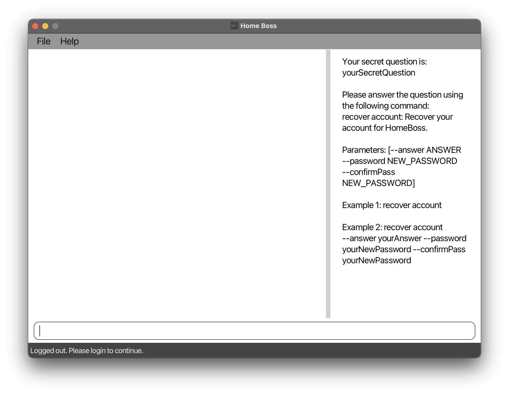

<div style="page-break-after: always;"></div><br/>

* `recover account --answer Koko --password NewPassword123 --confirmPass NewPassword123` </br>

  Recovers the account with the answer `Koko` and sets the new password to `NewPassword123`.

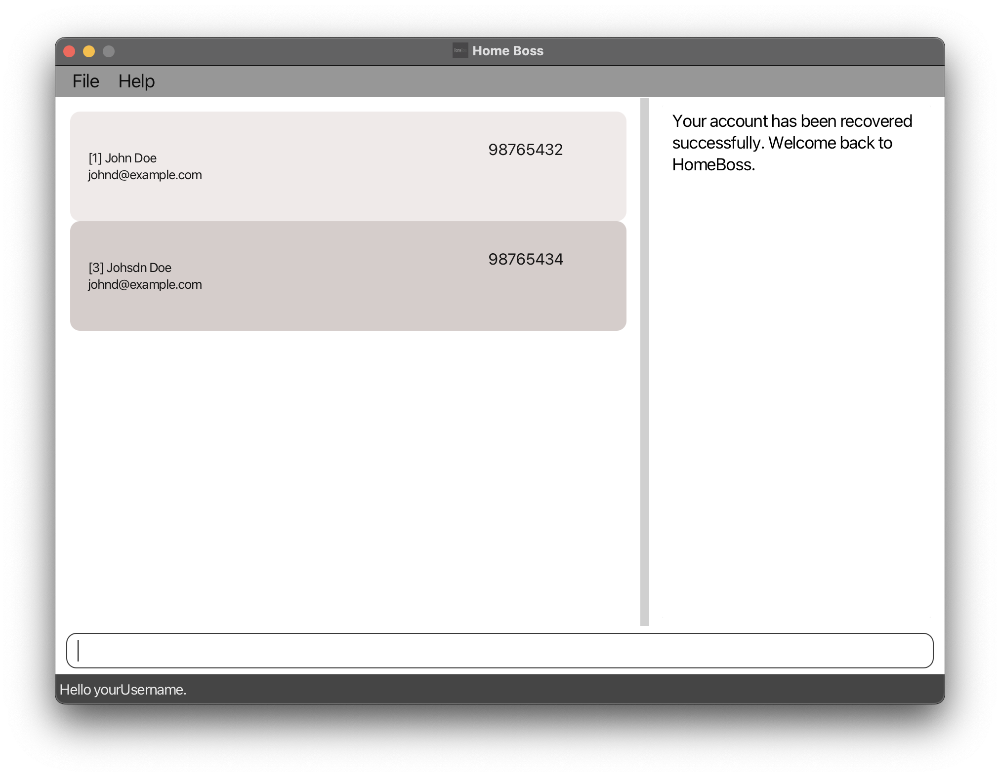

<br/>

[&uarr; Back to Table of Contents](#table-of-contents)

<div style="page-break-after: always;"></div><br/>

### Delete Account

If you simply want to erase all your data from HomeBoss, you can delete your account by calling this command.

</br>**Format:** `delete account`{.swift}

<br />

<box type="tip" background-color="#d9edf7" border-color="#bce8f1" icon=":bulb:">

**Tip:** This command should be considered as a last resort, to be used if you forget both your password and your secret
answer.
However, if you've forgotten your password but recall the answer to your secret question, you can initiate the account
recovery process by using the `recover account`{.swift} command [here](#recover-account).

</box>

<br/>

[&uarr; Back to Table of Contents](#table-of-contents)
</br>

<div style="page-break-after: always;"></div>

## </br><span style="text-decoration:underline;font-size:29px"><strong>Customer</strong></span>

### Add a Customer

You can add a new Customer's details into HomeBoss with this command.

<br />
<box type="note" background-color="#dff0d8" border-color="#d6e9c6" icon=":information_source:">

**Note:**

* Customers consist of a name, a phone number, an email, and an address.<br/><br/>
* HomeBoss does not allow you to add Customers with the same phone number.<br/><br/>
* A unique Customer ID (may not be consecutive) will be assigned to the Customer.<br/>

</box>

</br>**Format:**

`customer add --name NAME --phone PHONE_NUMBER --email EMAIL --address ADDRESS`{.swift}

<br />

<box type="info" background-color="#fcf8e3" border-color="#fcf8ff" icon=":gear:">

**Parameters:**

* `NAME`{.swift} must be alphanumeric and can contain spaces.<br/><br/>
* `PHONE_NUMBER`{.swift} must be exactly 8 digits.<br/><br/>
* `EMAIL`{.swift} must follow the `local@domain`{.swift} format.<br/><br/>
* `ADDRESS`{.swift} can take any characters.<br/>

</box>

<div style="page-break-after: always;"></div>

</br>**Example:**

* `customer add --name Gabriel --phone 87654321 --email gabrielrocks@gmail.com --address RVRC Block B` </br>

  Adds a Customer with the name `Gabriel`, phone number `87654321`,
  email `Gabrielrocks@gmail.com`and address `RVRC Block B`.


<br/>

[&uarr; Back to Table of Contents](#table-of-contents)

<div style="page-break-after: always;"></div>

### </br>View details of a Customer

You can view the details of a Customer by calling this command. The data displayed includes the Customer's name, phone
number, email and address.

</br>**Format:**

`customer view CUSTOMER_ID`{.swift}

<br />

<box type="info" background-color="#fcf8e3" border-color="#fcf8ff" icon=":gear:">

**Parameter:** `CUSTOMER_ID`{.swift} must be an integer greater than 0 that corresponds to an existing Customer.

  </box>

<br>**Example:**

* `customer view 1` </br>

  Displays the details of Customer with ID `1`.

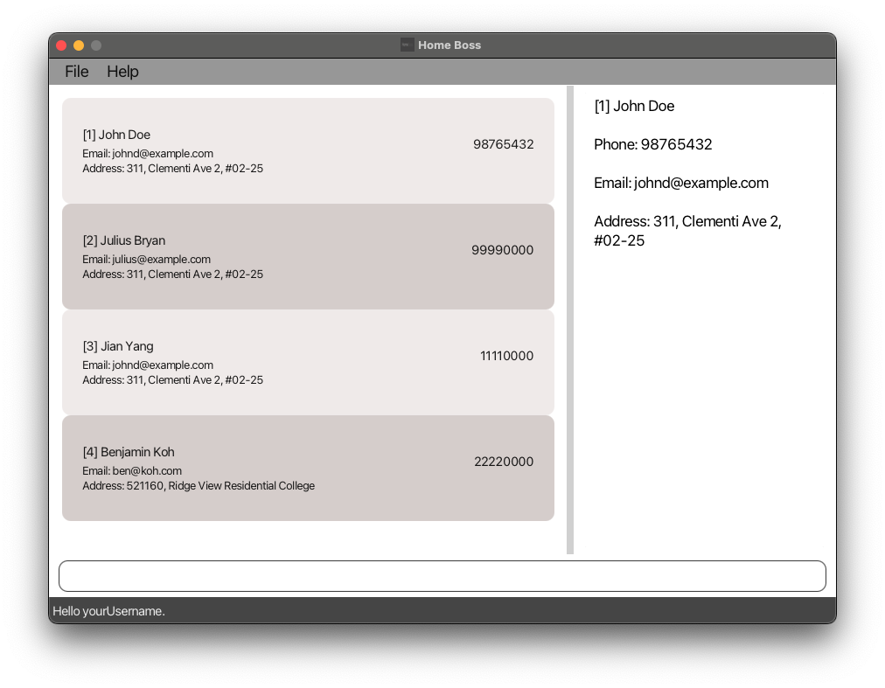

[&uarr; Back to Table of Contents](#table-of-contents)

<div style="page-break-after: always;"></div><br/>

### View a list of Customers

This command allows you to view a list of all the Customers that you have added to HomeBoss.

<br />

**Format:** `customer list`{.swift}

<br />

<box type="tip" background-color="#d9edf7" border-color="#bce8f1" icon=":bulb:">

**Tip:** You can use this command together with `delivery list`{.swift} to switch between the two lists.

</box>

<br/>

[&uarr; Back to Table of Contents](#table-of-contents)

### </br></br>Find Customers

If you want to get the details of a Customer, but do not remember the Customer's full name or the Customer's ID,
you can find the Customer with this command. It finds Customers whose names has words that exactly match any of the
given keywords.

<br />

<box type="note" background-color="#dff0d8" border-color="#d6e9c6" icon=":information_source:">

**Note:**

* You must provide at least one keyword to search for the Customer.<br/><br/>
* You can optionally provide additional keywords. Customer names that matches any of the given keywords will be
  displayed. For example, the keywords `Alex` and `Tan` in `Alex Tan` will display `Alex Wong`, `Alex Tan`,
  and `Tan Ah Meng`.<br/><br/>
* The keyword must exactly match any word in the Customer's name. For example, the keyword `Alex` will match `Alex` but
  not `Alexander`.<br/><br/>
* You can input any keyword, even if it's not a valid name. For example, even though names contain a strict requirement to include only alphanumeric characters, you still have the flexibility to search for keywords that contain non-alphanumeric characters e.g. `A_lex`.<br/><br/>
* The search is not case sensitive.<br/>

</box>

</br>**Format:**

`customer find KEYWORD [MORE_KEYWORDS...]`{.swift}

<br/>

<div style="page-break-after: always;"></div><br/>

<box type="info" background-color="#fcf8e3" border-color="#fcf8ff" icon=":gear:">

**Parameters:**

* Each `KEYWORD`{.swift} cannot contain spaces. Spaces are used to differentiate between various keywords.<br/><br/>
* If there's more than one `KEYWORD`{.swift}, there has to be a space between each `KEYWORD`{.swift}.<br/>

</box>

</br>**Example:**

* `customer find Julius Yang`</br>

  Finds Customers whose names have words that exactly match either `Julius` or `Yang`.


<br/>

[&uarr; Back to Table of Contents](#table-of-contents)

<div style="page-break-after: always;"></div><br/>

### Update details of a Customer

This command is useful for updating the details of a Customer, such as due to a change in particulars or in the event
that you keyed in the Customer's details wrongly.

</br>**Format:**

`customer edit CUSTOMER_ID [--name NAME] [--phone PHONE_NUMBER] [--email EMAIL] [--address ADDRESS]`{.swift}

<br/>

<box type="info" background-color="#fcf8e3" border-color="#fcf8ff" icon=":gear:">

**Parameters:**

* At least one of the optional fields must be provided. <br/><br/>
* `CUSTOMER_ID`{.swift} must be an integer greater than 0 that corresponds to an existing Customer's ID.<br/><br/>
* `NAME`{.swift} must be alphanumeric and can contain spaces.<br/><br/>
* `PHONE_NUMBER`{.swift} must be exactly 8 digits.<br/><br/>
* `EMAIL`{.swift} must follow the `local@domain`{.swift} format.<br/><br/>
* `ADDRESS`{.swift} can take any characters.<br/>

</box>

</br>**Examples:**

* `customer edit 1 --name Gabriel --phone 98131051` </br>

  Edits the name of the Customer, with Customer ID of `1`, to `Gabriel` and his phone to `98131051`.

* `customer edit 2 --name Joe --email yangyang@gmail.com --address Block 10 Tampines Road` </br>

  Edits the name of the Customer, with Customer ID of `2`, to `Joe`, his email to `yangyang@gmail.com` and his address
  to
  `Block 10 Tampines Road`.

<br/>


[&uarr; Back to Table of Contents](#table-of-contents)

<div style="page-break-after: always;"></div><br/>

### Delete a Customer

You can delete any Customer who no longer require your services by calling this command.

<br/>


<box background-color="#f2dede" border-color="#ebccd1" type="warning" icon=":exclamation:">

**Warning:** Be careful! All Deliveries associated with the Customer will also be deleted. You won't be able to undo
this deletion!
</box>

</br>**Format:**

`customer delete CUSTOMER_ID`{.swift}

<br />

<box type="info" background-color="#fcf8e3" border-color="#fcf8ff" icon=":gear:">

**Parameter:** `CUSTOMER_ID`{.swift} must be an integer greater than 0 that corresponds to an existing Customer.

</box>

</br>**Example:**

* `customer delete 1` </br>

  Deletes the Customer with ID `1`.

<br/>

[&uarr; Back to Table of Contents](#table-of-contents)
</br>

<div style="page-break-after: always;"></div>

## </br><span style="text-decoration:underline;font-size:29px"><strong>Delivery</strong></span>

### Add a Delivery

By using this command, you can incorporate Deliveries associated with your Customers into HomeBoss. Adding a Delivery is
the initial step that later enables you to monitor the Delivery's status and other relevant details with our suite of
Delivery-related commands.

<br/>

<box type="note" background-color="#dff0d8" border-color="#d6e9c6" icon=":information_source:">

**Note:**

* Deliveries consist of a Delivery name, a Customer ID, an order date, an expected Delivery date, a Delivery status, an address to ship to, and a Delivery note (optional). The Delivery note can be added only after the creation of a Delivery, using the `delivery note`{.swift} command [here](#create-a-note-for-a-delivery).

* You don't have to fill in order date, Delivery status and address. Instead they will be initialised with these values:
  
    * Order date: Today's date
  
    * Delivery status: `CREATED`
  
    * Address: Customer's address

* Delivery status can be one of `CREATED`, `SHIPPED`, `COMPLETED`, `CANCELLED`. <br/>

</box>

</br>**Format:**

`delivery add DELIVERY_NAME --customer CUSTOMER_ID --date EXPECTED_DELIVERY_DATE`{.swift}

<br />

<box type="info" background-color="#fcf8e3" border-color="#fcf8ff" icon=":gear:">

**Parameters:**

* `DELIVERY_NAME`{.swift} must be alphanumeric and can contain spaces.<br/><br/>
* `CUSTOMER_ID`{.swift} must be an integer greater than 0 that corresponds to an existing Customer.<br/><br/>
* `EXPECTED_DELIVERY_DATE`{.swift} must be today or after today's date in yyyy-MM-dd format.<br/>

</box>

<div style="page-break-after: always;"></div>

</br>**Example:**

* `delivery add Chocolate Cake --customer 1 --date 2023-12-12` </br>

Adds a Delivery with the name `Chocolate Cake` for the Customer with ID `1`. The expected Delivery date is set
to `2023-12-12`, the order date is automatically set to today's date, the Delivery status is initialised to `CREATED`,
and the Delivery address is the same as the Customer's address.


<br/>

[&uarr; Back to Table of Contents](#table-of-contents)

<div style="page-break-after: always;"></div><br/>

### View details of a Delivery

You can view the details of a Delivery by calling this command. The data displayed includes the Delivery's name, status,
Customer, Customer ID, address, order date, expected Delivery date and notes (if any).

</br>**Format:**

`delivery view DELIVERY_ID`{.swift}

<br />

<box type="info" background-color="#fcf8e3" border-color="#fcf8ff" icon=":gear:">

**Parameter:** `DELIVERY_ID`{.swift} must be an integer greater than 0 that corresponds to an existing Delivery.

</box>

</br>**Example:**

* `delivery view 1` </br>

  Displays the details of the Delivery with Delivery ID of `1`.

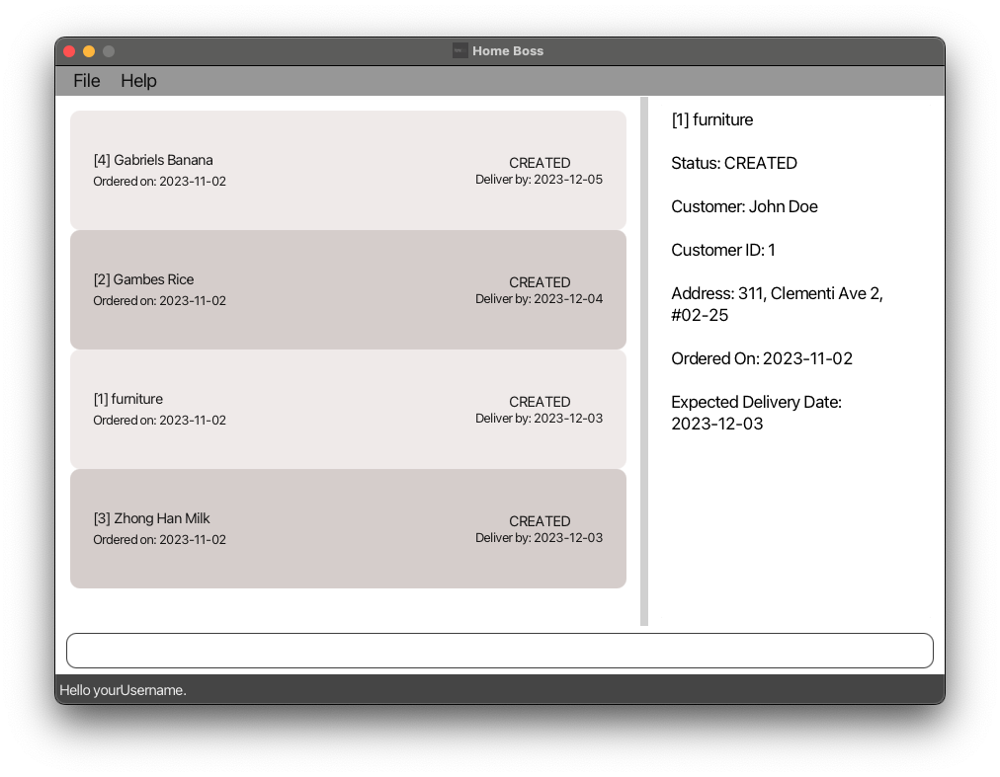

<br/>

[&uarr; Back to Table of Contents](#table-of-contents)

<div style="page-break-after: always;"></div><br/>

### View a list of Deliveries

This command allows you to view a list of all the Deliveries that you have added to HomeBoss.

<br/>

<box type="note" background-color="#dff0d8" border-color="#d6e9c6" icon=":information_source:">

**Note:** This is a more powerful command than `customer list`{.swift}, as it allows you to filter the list of
Deliveries by status, Customer ID and/or expected Delivery date. This command also allows you to sort the list of
Deliveries by expected Delivery date in either ascending or descending order. By default, the list of Deliveries will be
sorted by expected Delivery date in descending order (latest first).

</box>

</br>**Format:**

`delivery list [--status STATUS] [--customer CUSTOMER_ID] [--date EXPECTED_DELIVERY_DATE]  [--sort SORT]`{.swift}

<br />

<box type="info" background-color="#fcf8e3" border-color="#fcf8ff" icon=":gear:">

**Parameters:**

* `STATUS`{.swift} accepts the following values: `CREATED`/`SHIPPED`/`COMPLETED`/`CANCELLED`.<br/><br/>
* `CUSTOMER_ID`{.swift} must be an integer greater than 0 that corresponds to an existing Customer.<br/><br/>
* `EXPECTED_DELIVERY_DATE`{.swift} must be today or after today's date in yyyy-MM-dd format OR
  `TODAY` for today’s date.<br/><br/>
* `SORT`{.swift} accepts the following values: `ASC`/`DESC`.<br/><br/>
* If duplicate prefixes are provided, only the last occurrence of each prefix will be used.<br/>

  </box>

  <div style="page-break-after: always;"></div>

</br>**Example:**

* `delivery list --status CREATED --customer 1 --sort DESC`</br>

  Lists all Deliveries with status `CREATED` for Customer with ID `1` with expected Delivery date in
  descending order.

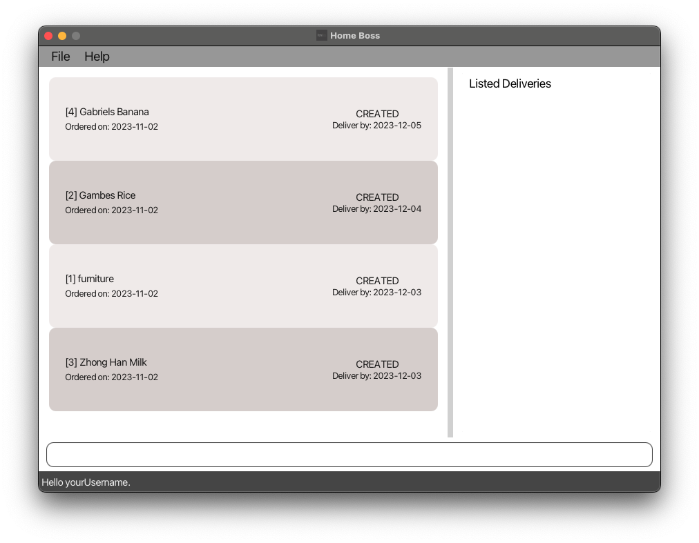

<box type="tip" background-color="#d9edf7" border-color="#bce8f1" icon=":bulb:">

**Tips:**

* You may combine any of the filter and sort options to get the list of Deliveries that you want. <br/><br/>
* Delivery status is not case sensitive. You can type `created` instead of `CREATED` and it will still work.<br/>

</box>

<br/>

[&uarr; Back to Table of Contents](#table-of-contents)

<div style="page-break-after: always;"></div><br/>

### Find Deliveries

If you cannot remember the full name of a Delivery, you can find the Delivery with this command. It finds Deliveries
whose names has words that exactly match any of the given keywords.

<br />

<box type="note" background-color="#dff0d8" border-color="#d6e9c6" icon=":information_source:">

**Note:**

* You must provide at least one keyword to search for the Delivery.<br/><br/>
* You can optionally provide additional keywords. Deliveries that has names matching any of the given keywords will be
  displayed. For example, the keywords `Chocolate` and `Bun` in `Chocolate Bun` will
  display `Chocolate Cake`, `Chocolate Bun`, and `Strawberry Bun`.<br/><br/>
* The keyword must exactly match any word in the Delivery name. For example, the keyword `Straw` will match `Straw` but
  not `Strawberry`.<br/><br/>
* The search is not case sensitive.<br/>

</box>

</br>**Format:**

`delivery find KEYWORD [MORE_KEYWORDS...]`{.swift}

<br/>

<box type="info" background-color="#fcf8e3" border-color="#fcf8ff" icon=":gear:">

**Parameters:**

* Each `KEYWORD`{.swift} cannot contain spaces. Spaces are used to differentiate between various keywords.<br/><br/>
* If there's more than one `KEYWORD`{.swift}, there has to be a space between each `KEYWORD`{.swift}.<br/>

</box>

<div style="page-break-after: always;"></div>

</br>**Example:**

* `delivery find Gambes Banana` </br>

  Finds all Deliveries whose name has words that exactly match `Gambes` or `Banana`.

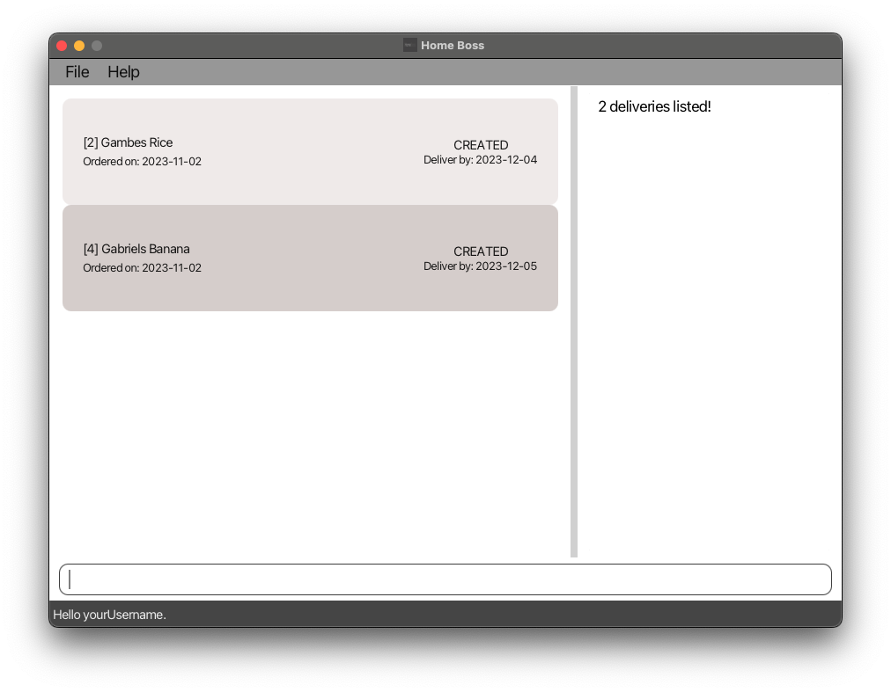

<br/>

[&uarr; Back to Table of Contents](#table-of-contents)

<div style="page-break-after: always;"></div><br/>

### Update details of a Delivery

This command is useful for updating the details of a Delivery, such as due to a change in the details of a Delivery or
in the event that you keyed in the Delivery's details wrongly.

<br />

<box background-color="#f2dede" border-color="#ebccd1" type="warning" icon=":exclamation:">

**Warning:** Be careful! You won't be able to undo this edit action!

</box>

</br>**Format:**

`delivery edit DELIVERY_ID [--name DELIVERY_NAME] [--customer CUSTOMER_ID] [--date EXPECTED_DELIVERY_DATE][--status STATUS] [--note NOTE]`{.swift}

<br/>

<box type="info" background-color="#fcf8e3" border-color="#fcf8ff" icon=":gear:">

**Parameters:**

* At least one of the optional fields must be provided.<br/><br/>
* `DELIVERY_ID`{.swift} must be an integer greater than 0 that corresponds to an existing Delivery.<br/><br/>
* `DELIVERY_NAME`{.swift} must be alphanumeric and can contain spaces.<br/><br/>
* `CUSTOMER_ID`{.swift} must be an integer greater than 0 that corresponds to an existing Customer.<br/><br/>
* `EXPECTED_DELIVERY_DATE`{.swift} must be today or after today's date in yyyy-MM-dd format.<br/><br/>
* `STATUS`{.swift} accepts the following values: `CREATED`/`SHIPPED`/`COMPLETED`/`CANCELLED`.<br/><br/>
* `NOTE`{.swift} must be alphanumeric and can contain spaces.<br/>

</box>

<div style="page-break-after: always;"></div>

</br>**Examples:**

* `delivery edit 1 --status CANCELLED --note Sudden overseas business trip to attend to` </br>

  Edits the Delivery's status of the Delivery, with Delivery ID of `1`, to `CANCELLED` and edits the note of the
  Delivery to `Sudden overseas business trip to attend to`. If this Delivery does not already have a note, a note will
  be created for it.

* `delivery edit 2 --name Vanilla Cake --customer 3` </br>

  Edits the name of the Delivery, with Delivery ID of `2`, to `Vanilla Cake` and edits the Customer of the
  Delivery to the Customer with ID of `3`.

<br/>

<box type="tip" background-color="#d9edf7" border-color="#bce8f1" icon=":bulb:">

**Tips:**

* If you only want to update the Delivery's status, simply use `delivery status`{.swift} instead. </br><br/>
* Delivery status is not case sensitive. You can type `created` instead of `CREATED` and it will still work. </br><br/>
* If you only want to create or update the Delivery's note, you can use `delivery note`{.swift} instead as a shortcut.<br/>
  </box>

<br/>

[&uarr; Back to Table of Contents](#table-of-contents)

<div style="page-break-after: always;"></div><br/>

### Update status of a Delivery

An order can have one of the following statuses: CREATED, SHIPPED, COMPLETED or CANCELLED. This command allows you to
update the status of a Delivery to any of the aforementioned statuses, according to the progress of the Delivery for
your easy tracking.

</br>**Format:** `delivery status DELIVERY_ID STATUS`{.swift}

<br />

<box type="info" background-color="#fcf8e3" border-color="#fcf8ff" icon=":gear:">

**Parameters:**

* `DELIVERY_ID`{.swift} must be an integer greater than 0 that corresponds to an existing Delivery.<br/><br/>

* `STATUS`{.swift} accepts the following values: `CREATED`/`SHIPPED`/`COMPLETED`/`CANCELLED`.<br/>

  </box>

</br>**Examples:**

* `delivery status 1 CANCELLED` </br>

  Updates the status of Delivery with ID `1` to `CANCELLED`.

* `delivery status 2 SHIPPED` </br>

  Updates the status of Delivery with ID `2` to `SHIPPED`.

<br/>

<box type="tip" background-color="#d9edf7" border-color="#bce8f1" icon=":bulb:">

**Tip:** Delivery status is not case sensitive. You can type `created` instead of `CREATED` and it will still work.

</box>

<br/>

[&uarr; Back to Table of Contents](#table-of-contents)

<div style="page-break-after: always;"></div><br/>

### Create a note for a Delivery

If you would like to create a note about a specific Delivery, this command allows you to do so as a shortcut, as opposed
to using the lengthier `delivery edit`{.swift} command found [here](#update-details-of-a-delivery).

<br />

<box type="note" background-color="#dff0d8" border-color="#d6e9c6" icon=":information_source:">

**Note:** If the Delivery already has a note, the previous note will be overwritten by the new given note.

</box>

</br>**Format:**

`delivery note DELIVERY_ID --note NOTE`{.swift}

<br/>

<box type="info" background-color="#fcf8e3" border-color="#fcf8ff" icon=":gear:">

**Parameters:**

* `DELIVERY_ID`{.swift} must be an integer greater than 0 that corresponds to an existing Delivery's ID.<br/><br/>
* `NOTE`{.swift} must be alphanumeric and can contain spaces.<br/>

</box>

</br>**Example:**

* `delivery note 1 --note By FedEx` </br>

  Creates a new note `By FedEx` for the Delivery with ID `1`.

<br/>

[&uarr; Back to Table of Contents](#table-of-contents)

<div style="page-break-after: always;"></div><br/>

### Delete a Delivery

If you feel that a Delivery is no longer relevant (i.e., cancelled or completed), you can delete it from HomeBoss using
this command.

<br/>

<box background-color="#f2dede" border-color="#ebccd1" type="warning" icon=":exclamation:">

**Warning:** Be careful! This action is irreversible. Once deleted, the Delivery cannot be recovered.

</box>

</br>**Format:**

`delivery delete DELIVERY_ID`{.swift}

<br />

<box type="info" background-color="#fcf8e3" border-color="#fcf8ff" icon=":gear:">

**Parameter:** `DELIVERY_ID`{.swift} must be an integer greater than 0 that corresponds to an existing Delivery.

</box>

</br>**Example:**

* `delivery delete 1` </br>

  Deletes the Delivery with ID of `1` from the Delivery database.

  <br/>

[&uarr; Back to Table of Contents](#table-of-contents)

<div style="page-break-after: always;"></div>

## </br><span style="text-decoration:underline;font-size:29px"><strong>Miscellaneous</strong></span>

### Help

This command allows you to view a summary of the commands available, the format of the commands, and a link to this user
guide.

<br/>

**Format:** `help`{.swift}

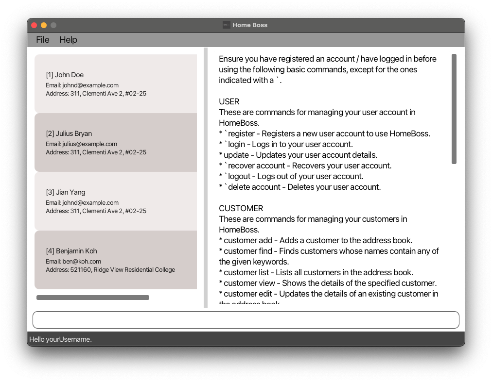

<box type="tip" background-color="#d9edf7" border-color="#bce8f1" icon=":bulb:">


**Tip:** This command can be used at any time, regardless of whether you are logged in or not.

</box>

<br/>

[&uarr; Back to Table of Contents](#table-of-contents)

<div style="page-break-after: always;"></div><br/>

### Exit

You can exit the program by calling this command.

<br/>

<box type="note" background-color="#dff0d8" border-color="#d6e9c6" icon=":information_source:">

**Note:** If you are logged in, this command will automatically log you out of your account and close the application.
</box>

**<br/>Format:** `exit`{.swift}

<br/>

<box type="tip" background-color="#d9edf7" border-color="#bce8f1" icon=":bulb:">


**Tip:** This command can be used at any time, regardless of whether you are logged in or not.

</box>

<br/>

[&uarr; Back to Table of Contents](#table-of-contents)

### </br></br>Clear

In the event that you want to perform a complete reset of HomeBoss' Customer and Delivery database, you can easily clear
all your Customer and Delivery data by calling this command.

<br/>

<box type="warning" background-color="#f2dede" border-color="#ebccd1" icon=":exclamation:">

**Warning:** Be careful, this action is irreversible! All your Customer and Delivery data will be deleted permanently.
Proceed with caution!

</box>

**<br/>Format:** `clear`{.swift}

<br/>

[&uarr; Back to Table of Contents](#table-of-contents)

<div style="page-break-after: always;"></div><br/>

# FAQ

<br/>

**Q: Where do I get support for HomeBoss?**

A: You can raise an issue on our [GitHub repository](https://github.com/AY2324S1-CS2103T-T13-3/tp/issues).<br/><br/>

**Q: How do I report a bug?**

A: You can raise a bug report on our [GitHub repository](https://github.com/AY2324S1-CS2103T-T13-3/tp/issues).<br/><br/>

**Q: How do I import my data from another software?**

A: You can import your data by converting your data into .json in the format of the Customer and Delivery data in the
data folder.<br/><br/>

**Q: How do I export my data to another software?**

A: It is currently not possible to export your data to another software.<br/><br/>

**Q: Why is there an error when I input non-English characters?**

A: HomeBoss only supports English characters.<br/><br/>

<br/>

[&uarr; Back to Table of Contents](#table-of-contents)

<div style="page-break-after: always;"></div><br/>

# Command Summary

## <span style="text-decoration:underline; font-size:29px"><strong>User</strong></span>

| Command  | Format                                                                                                                               | Examples                                                                                                                  |
|----------|--------------------------------------------------------------------------------------------------------------------------------------|---------------------------------------------------------------------------------------------------------------------------|
| Register | `register --user USERNAME --password PASSWORD --confirmPass CONFIRM_PASSWORD --secretQn SECRET_QUESTION --answer ANSWER`{.swift}     | `register --user Gabriel --password GabrielIsGreat --confirmPass GabrielIsGreat --secretQn First Pet Name? --answer Koko` |
| Login    | `login --user USERNAME --password PASSWORD`{.swift}                                                                                  | `login --user Gabriel --password GabrielIsGreat`                                                                          |
| Update   | `update [--user USERNAME] [--password PASSWORD --confirmPass CONFIRM_PASSWORD] [--secretQn SECRET_QUESTION --answer ANSWER]`{.swift} | `update --user GabrielV2 --password GabrielIsBest --confirmPass GabrielIsBest --secretQn Favourite Pet --answer BoBo`     |
| Recover  | `recover account [--answer ANSWER --password NEW_PASSWORD --confirmPass CONFIRM_PASSWORD]`{.swift}                                   | `recover account --answer Koko --password NewPassword123 --confirmPass NewPassword123`                                    |
| Logout   | `logout`{.swift}                                                                                                                     | `logout`                                                                                                                  |
| Delete   | `delete account`{.swift}                                                                                                             | `delete account`                                                                                                          |

<div style="page-break-after: always;"></div>

## </br><span style="text-decoration:underline; font-size:29px"><strong>Customer</strong></span>

| Command | Format                                                                                                       | Examples                                                                                                         |
|---------|--------------------------------------------------------------------------------------------------------------|------------------------------------------------------------------------------------------------------------------|
| Add     | `customer add --name NAME --phone PHONE_NUMBER --email EMAIL --address ADDRESS`{.swift}                      | `customer add --name Gabriel --phone 87654321 --email Gabrielrocks@gmail.com --address RVRC Block B`             |
| View    | `customer view CUSTOMER_ID`{.swift}                                                                          | `customer view 1`                                                                                                |
| List    | `customer list`{.swift}                                                                                      | `customer list`                                                                                                  |
| Find    | `customer find KEYWORD [MORE_KEYWORDS]`{.swift}                                                              | `customer find Julius Yang`                                                                                      |
| Edit    | `customer edit CUSTOMER_ID [--name NAME] [--phone PHONE_NUMBER] [--email EMAIL] [--address ADDRESS]`{.swift} | `customer edit 1 --name Gabriel --phone 97659320 --email Gabrielrock@gmail.com --address Block 10 Tampines Road` |
| Delete  | `customer delete CUSTOMER_ID`{.swift}                                                                        | `customer delete 1`                                                                                              |

<div style="page-break-after: always;"></div>

## <br/><span style="text-decoration:underline; font-size:29px"><strong>Delivery</strong></span>

| Command | Format                                                                                                                                              | Examples                                                                                                                   |
|---------|-----------------------------------------------------------------------------------------------------------------------------------------------------|----------------------------------------------------------------------------------------------------------------------------|
| Add     | `delivery add DELIVERY_NAME --customer CUSTOMER_ID --date EXPECTED_DELIVERY_DATE`{.swift}                                                           | `delivery add furniture --customer 5 --date 2023-12-03`                                                                    |
| View    | `delivery view DELIVERY_ID`{.swift}                                                                                                                 | `delivery view 1`                                                                                                          |
| List    | `delivery list [--status STATUS] [--customer CUSTOMER_ID] [--date EXPECTED_DELIVERY_DATE] [--sort SORT]`{.swift}                                    | `delivery list --status created --customer 1 --date 2023-12-12 --sort desc`                                                |
| Find    | `delivery find KEYWORD [MORE_KEYWORDS]`{.swift}                                                                                                     | `delivery find Chocolate Bun`                                                                                              |
| Edit    | `delivery edit DELIVERY_ID [--name DELIVERY_NAME] [--customer CUSTOMER_ID] [--date EXPECTED_DELIVERY_DATE] [--status STATUS] [--note NOTE]`{.swift} | `delivery edit 1 --name Chocolate Cake --customer 2 --date 2024-12-12 --status CANCELLED --note Customer changed his mind` |
| Status  | `delivery status DELIVERY_ID STATUS`{.swift}                                                                                                        | `delivery status 2 completed`                                                                                              |
| Note    | `delivery note DELIVERY_ID --note NOTE`{.swift}                                                                                                     | `delivery note 1 --note By FedEx`                                                                                          |
| Delete  | `delivery delete DELIVERY_ID`{.swift}                                                                                                               | `delivery delete 1`                                                                                                        |

<div style="page-break-after: always;"></div>

## <br/><span style="text-decoration:underline; font-size:29px"><strong>Miscellaneous</strong></span>

| Command | Format          | Examples |
|---------|-----------------|----------|
| Exit    | `exit`{.swift}  | `exit`   |
| Help    | `help`{.swift}  | `help`   |
| Clear   | `clear`{.swift} | `clear`  |

<br/>

[&uarr; Back to Table of Contents](#table-of-contents)

<br/>
