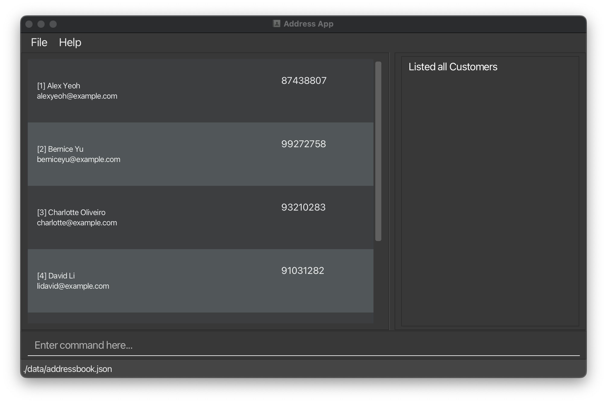
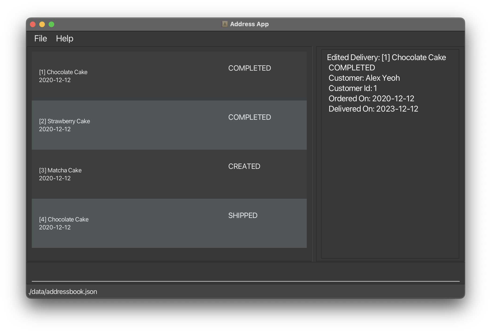

# User Guide for HomeBoss

This comprehensive user guide is your key to a seamless start with our cutting-edge software designed specifically for
home-based businesses. Our solution is tailored to enhance the efficiency of managing delivery addresses, simplifying
your operations. Within these pages, you'll find detailed coverage of the following essential topics:

- Getting Started
- Features
    - User
        - Register
        - Login
        - Update details
        - Logout
        - Account recovery
        - Account deletion
    - Customer
        - Add customer
        - Search for a customer [Coming Soon]
        - List customers
        - Update customer details
        - Delete customer
    - Delivery
        - Create delivery
        - View all deliveries
        - View details of deliveries
        - Update delivery status and date
        - Delete delivery
        - Create a note for a delivery
        - View deliveries for the day [Coming Soon]
        - Add customer data to delivery [Coming Soon]
        - Remove customer from delivery [Coming Soon]
        - Look up delivery details [Coming Soon]
- Troubleshooting / FAQ

# Getting Started

To get started, you will need to create an account and download the software. Once you have done that, you can follow
the instructions in the Getting Started Guide to start using the software.

# Features

\*[ ] specifies optional fields

## User

### Register

You can register for an account to use HomeBoss. Only one account can be registered at a time.

**Format:
** `register --user USERNAME --password PASSWORD --confirmPass CONFIRM_PASSWORD --secretQn SECRET_QUESTION --answer ANSWER`

**Example:
** `register --user gabriel --password gabrielIsGreat --confirmPass gabrielIsGreat --secretQn First pet's name? --answer Koko`

**Accepted Values:**

_USERNAME:_ String, consisting of only alphanumeric characters

_PASSWORD:_ String, consisting of at least 8 alphanumeric characters

_CONFIRM\_PASSWORD:_ String that is the same as _PASSWORD_

_SECRET\_QUESTION:_ String

_ANSWER:_ String, not case sensitive

**Command succeeds:** _Registration successful._

**Command fails (missing fields):** _Please fill up all the required fields._

**Command fails (password does not match):** _Passwords do not match. Try again._

**Command fails (missing secret question and answer):** _Please key in a secret question and answer for account
recovery. Try again._

### Login

**Format:** `login --user USERNAME --password PASSWORD`

**Example:** `login --user gabriel --password gabrielIsGreat`

**Accepted Values:**

_USERNAME:_ String, consisting of only alphanumeric characters

_PASSWORD:_ String, consisting of at least 8 alphanumeric characters

**Command succeeds:** _Log in successful._

**Command fails (missing fields):** _Please fill up all the required fields._

**Command fails (wrong login credentials):** _Wrong username and/or password. Try again._

### Update details

**Format:** `update [--user USERNAME] [--password PASSWORD --confirmPass CONFIRM_PASSWORD]
[--secretQn SECRET_QUESTION --answer ANSWER]`

**Example:** `login --user gabrielV2 --password gabrielIsBest --confirmPass gabrielIsBest
--secretQn Favourite Pet --answer BoBo`

**Accepted Values:**

_USERNAME:_ String, consisting of only alphanumeric characters

_PASSWORD:_ String, consisting of at least 8 alphanumeric characters

_CONFIRM\_PASSWORD:_ String that is the same as _PASSWORD_

_SECRET\_QUESTION:_ String

_ANSWER:_ String

*At least one of the optional fields must be provided.
If PASSWORD is provided, CONFIRM_PASSWORD must also be provided, vice versa.
If SECRET_QUESTION is provided, ANSWER must also be provided, vice versa.
The details will be updated without checking against the current details.

**Command succeeds:** _Update successful._

**Command fails (missing fields):** _Please provide at least one field to update!_

**Command fails (passwords do not match):** _Passwords do not match. Try again._

**Command fails (only one of password/confirm password is provided):**
_Password and Confirm Password have to be either all present or all absent. Try again._

**Command fails (only one of secret question/answer is provided):**
_Secret Question and Answer have to be either all present or all absent. Try again._

### Logout

**Format:** `logout`

**Example:** `logout`

### Account Recovery

**Format:** `recover account [--answer ANSWER --password NEW_PASSWORD --confirmPass CONFIRM_PASSWORD]`

**Example 1:** `recover account` 
**Example 2:** `recover account --answer Koko --password newPassword123 --confirmPass newPassword123` 

**Accepted Values:**

_ANSWER:_ String, not case sensitive

_NEW\_PASSWORD:_ String

_CONFIRM\_PASSWORD:_ String that is the same as _NEW\_PASSWORD_

*`--answer`, `--password`, and `--confirmPass` flags have to be either all present or all absent.

**Command succeeds (without flags):** _Your secret question is: \<previously stored secret qn\>._

**Command succeeds (with flags):** _Your account has been recovered successfully. Welcome back to HomeBoss._

**Command fails (missing fields):** _Please fill up all the required fields._

**Command fails (wrong answer to secret question):** _Wrong answer to secret question. Either try again or
call `delete account` (permanent loss of stored data)._

**Command fails (password does not match):** _Passwords do not match. Try again._

### Account Deletion

**Format:** `delete account`

**Example:** `delete account`

**Command succeeds:** _User deleted successfully._

**Command fails (no user registered):** _No accounts found. Please register an account first._

## Customer

### Add a customer

Adds a customer to the address book.

**Format:** `customer add --name NAME --phone PHONE_NUMBER --email EMAIL --address ADDRESS`

**Example:** `customer add --name Gabriel --phone 87654321 --email gabrielrocks@gmail.com --address RVRC Block B`

**Accepted Values:**

_NAME_: String

_PHONE_NUMBER_: 8 digit Integer

_EMAIL_: String with @ and . in valid email format

_ADDRESS_: String

**Command succeeds:** _Customer 1, Gabriel added._

**Command fails (missing field):** _Please fill up all the required fields (--name NAME --phone PHONE_NUMBER --email
EMAIL --address ADDRESS)._

### Find customers

You can find customers whose names have a word that matches _ANY_ of the given keywords.

**Format:** `customer find KEYWORD [MORE_KEYWORDS]`

**Example:** `customer find Ibrahim Yu`

**Accepted Values:**

_KEYWORD_: One word

_MORE\_KEYWORDS_: More _KEYWORDs_ separated by spaces

**Command succeeds:**

//TODO: Add image

**Command fails (missing_keyword):** _Please provide at least one keyword to search for!_

### List customers

Lists all the customers added in the address book.

**Format:** `customer list`

**Example:** `customer list`

**Accepted Values:**

_NIL_

**Command succeeds (>0 customers):**

**Command succeeds (0 customer):** _There are currently no customers!_

_Details coming soon..._

### Update customer details

Updates the personal details of an existing customer in the address book.

**Format:** `customer edit CUSTOMER_ID [--name NAME] [--phone PHONE_NUMBER] [--email EMAIL] [--address ADDRESS]`

**Example:
** `customer edit 1001 --name Gabriel -–phone 1234 5678 --email gabrielSoCool@gmail.com --address RVRC Block B Ben's Room`

**Accepted Values:**

_NAME_: String

_PHONE_NUMBER_: 8 digit Integer

_EMAIL_: String with @ and . in valid email format

_ADDRESS_: String

_CUSTOMER_ID_: Integer

*At least one of the optional fields must be provided.

**Command succeeds:** _Customer 1, Gabriel has been updated!_

**Command fails (missing_index):** _Please specify the customer to update._

**Command fails (invalid_index):** _The customer does not exist!_

**Command fails (missing_fields):** _Please provide at least one field to update!_

### Delete customer

Deletes the specified customer from the address book.

**Format:** `customer delete CUSTOMER_ID`

**Example:** `customer delete 1001`

**Accepted Values:**

_CUSTOMER_ID:_ Integer

**Command succeeds:** _Customer 1, Gabriel has been deleted!_

**Command fails (missing_index):** _Please specify the customer to delete._

**Command fails (invalid_index):** _The customer does not exist!_

**Command fails (pending_delivery_customer_index):** _Delivery for Customer 1, Gabriel is not completed yet!_

## Delivery

### Add delivery

Adds a delivery to the delivery book.

**Format:** `delivery add DELIVERY_NAME --customer CUSTOMER_ID --date EXPECTED_DELIVERY_DATE`

**Example:** `delivery add furniture --customer 5 --date 2023-12-03`

**Accepted Values:**

_DELIVERY_NAME:_ String of 50 characters

_CUSTOMER_ID:_ Integer

_EXPECTED_DELIVERY_DATE:_ Expected Delivery Date String in YYYY-MM-DD format or `today` for today’s date

**Command succeeds:** _Delivery [1001] furniture created successfully for Customer 1, Gabriel!_

**Command fails (missing_fields):** _Please fill up all the required fields (DELIVERY_NAME --customer CUSTOMER_ID --date
DELIVERY_DATE)!_

**Command fails (invalid_date):** _Expected Delivery Date cannot be before today!_

**Command fails (invalid_date_format):** _Please provide the date in the format: yyyy-MM-dd._

### View all deliveries

Shows a list of all deliveries.

**Format:** `delivery list [--status STATUS] [--customer CUSTOMER_ID] [--date EXPECTED_DELIVERY_DATE]  [--sort SORT]`

**Example:** `delivery list --status created --customer 1 --date 2023-12-12 --sort desc`

**Accepted Values:**

_STATUS_: CREATED/SHIPPED/COMPLETED/CANCELLED. If unspecified, defaults to show all deliveries.

_CUSTOMER_ID_: Integer

_EXPECTED_DELIVERY_DATE_: Expected Delivery Date String in YYYY-MM-DD format or `today` for today’s date

_SORT_: String of either `asc` for ascending or `desc` for descending or defaults to sort by expected delivery date.

**Command succeeds (>0 deliveries):**

**Command failed (0 deliveries):** _There are currently no deliveries!_

### View details of deliveries

Shows the details of the specified delivery.

**Format:** `delivery view DELIVERY_ID`

**Example:** `delivery view 1001`

**Accepted Values:**

_DELIVERY_ID_: Integer

**Command succeeds:**

**Command failed (0 deliveries):** _There are currently no deliveries._

### Look up delivery details `[Coming Soon in v1.3]`

_Details coming soon..._

### Update delivery status

Changes the status of a specified delivery

**Format:** `delivery status STATUS CUSTOMER_ID`

**Example:** `delivery status completed 2`

**Accepted Values:**

_STATUS:_ Either `CREATED`/`SHIPPED`/`COMPLETED`/`CANCELLED`

_CUSTOMER_ID:_ Integer

**Command succeeds:**

**Command fails (invalid_status):** _Delivery Status should be one of CREATED, SHIPPED, COMPLETED, CANCELLED_

**Command fails (invalid_index):** _The delivery index provided is invalid_

**Command fails (missing_fields):**

_Invalid command format!_ 
_delivery status: Edits the status of the delivery identified by the ID of the delivery. Existing status will be
overwritten by the input status._ 
_Parameters: STATUS (must be one of CREATED/SHIPPED/COMPLETED/CANCELLED) ID (must be a integer representing a valid
ID)_ 
_Example: delivery status COMPLETED 1_ 

#### Update delivery details

Updates the delivery details of an existing delivery in the delivery book.

**Format:** `delivery edit DELIVERY_ID [--name DELIVERY_NAME] [--customer CUSTOMER_ID] [--date EXPECTED_DELIVERY_DATE]
[--status STATUS] [--note NOTE]`

**Example:** `delivery edit 1001 --name Chocolate Cake --customer 2 --date 2024-12-12 --status CANCELLED --note
Customer changed his mind.`

**Accepted Values:**

_DELIVERY_ID:_ Integer

_DELIVERY_NAME:_ String

_CUSTOMER_ID:_ Integer

_EXPECTED_DELIVERY_DATE:_ Expected Delivery Date String in YYYY-MM-DD format or `today` for today’s date

_STATUS:_ Either `CREATED`/`SHIPPED`/`COMPLETED`/`CANCELLED`

_NOTE:_ String

**Command succeeds:**
//TODO: Add image

**Command fails (missing_index):** _Invalid command format!_

**Command fails (invalid_index):** _The delivery index provided is invalid_

**Command fails (missing_fields):** _Please provide at least one field to update!_

### Create a note for a delivery

Creates a note for a specified delivery

**Format:** `delivery note DELIVERY_ID --note NOTE`

**Example:** `delivery note 1 --note By FedEx`

**Accepted Values:**

_DELIVERY_ID_: Integer

_NOTE_: Nonempty alphanumeric string

**Command succeeds:**

**Command failed (invalid_index):** _The delivery index provided is invalid_

**Command failed (invalid_note):** _Note should not be empty_

**Command failed (missing_fields):**

_Invalid command format!_ 
_delivery note: Adds a note to the delivery identified by the ID of the delivery. Existing note if any will be replaced
with the input note._ 
_Parameters: DELIVERY_ID (must be a integer representing a valid ID) --note Note_ 
_Example: delivery note 1 --note This is a note_ 

### Add customer data to delivery `[Coming Soon in v1.3]`

_Details coming soon..._

### Delete delivery

Deletes the specified delivery.

**Format:** `delivery delete DELIVERY_ID`

**Example:** `delivery delete 1001`

**Accepted Values:**

_DELIVERY_ID_: Integer

**Command succeeds:** _Delivery [1001] Gabriel’s Milk deleted!_

**Command failed (delivery_id missing):** _Please specify a delivery id to delete!_

**Command failed (delivery_id not in database):** _This delivery does not seem to exist!_

### Remove customer from delivery `[Coming Soon in v1.3]`

_Details coming soon..._
